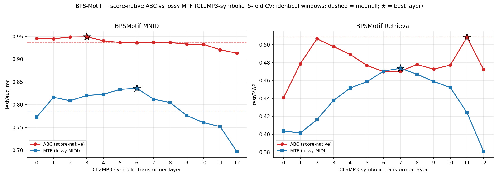

# BPS-Motif — score-native **ABC** vs lossy **MIDI→MTF** (CLaMP3-symbolic)

**Question.** CLaMP3-symbolic's M3 encoder was trained on two text views of
music: **MTF** (a lossless serialisation of MIDI *performance* — exact
ticks/velocities, message-segmented) and **interleaved ABC** (bar-segmented
*notation* — key, pitch spelling, meter, beaming). The BPS-Motif pipeline feeds
MTF, produced from the upstream point-set CSV by a lossy
`csv_notes → 60-QPM MIDI → MTF` round-trip. Does feeding **score-native ABC** —
reconstructed directly from `csv_notes`, preserving the pitch spelling / meter /
bar structure the MIDI round-trip discards — match or beat MTF on BPS-Motif's
two tasks (window-level motif classification + within-piece motif retrieval)?

This is the BPS-Motif companion to [`docs/jkupdd_abc_vs_mtf.md`](jkupdd_abc_vs_mtf.md)
(where content-matched note-level ABC matched-to-beat MTF and the depth peak
moved deep, L9–L11). The lesson of that A/B was that the comparison is only
meaningful **if both arms embed the same notes** — a content-matched build is
the whole game. So this build is **content-parity-gated** before any sweep.

## Option B (csv_notes-direct) — no kern, no alignment

BPS-Motif has no `**kern` / score-XML edition; the only symbolic source is the
upstream point-set CSV. So we do NOT round-trip through a score and do NOT do any
alignment. We reconstruct each window's notes **directly from `csv_notes`**,
byte-for-byte matching the MTF window in note content
(`scripts/data/build_bps_motif_abc.py`):

* **Same windows.** We read the *already-built* MTF JSONLs
  (`data/BPS-Motif/BPSMotif.{MNID,Retrieval}.fold{F}.{split}.jsonl`) and emit one
  ABC record per MTF record, carrying the SAME `piece_id` / `fold` / `split` /
  `is_motif` / `motif_letter` / `occurrence_id` / `start_sec` / `end_sec`. So the
  ABC task's labels / `work_id` / relevance / CV folds are **byte-identical** to
  MTF and the per-layer numbers are directly comparable.
* **Same notes.** The MTF builder synthesises a 60-QPM movement MIDI (1 beat =
  1 second; a negative pickup onset is clamped to t=0, duration preserved) then
  slices each window by *time* across **all staves**, clipping notes to the
  window edge and re-zeroing to the window start. We replicate that exact slicing
  — same clamp, same all-staff overlap test (the MTF slice does **not** filter by
  `track`), same clip+rezero — carrying each note's `morphetic_number` to spell
  pitches diatonically (anchored C4=morphetic-60: the morphetic number fixes the
  letter+octave, the accidental makes the sounding pitch match the MIDI).
* **Single voice.** The matched notes go into one music21 Part at their re-zeroed
  onsets (cross-staff simultaneities become a bar-local cluster, as they coexist
  in the MTF window), carrying the movement time signature for a correct `M:`
  header, then `makeMeasures` + `score_to_abc` (the shared
  `marble/encoders/CLaMP3/abc_util.py` converter: music21 → MusicXML → vendored
  xml2abc → abctoolkit interleave — the same path JKUPDD/SuperMario ABC use).
* **Notation grid.** The MTF arm tolerates any float duration (MIDI ticks);
  MusicXML/ABC cannot notate an arbitrary fraction. The *negative* windows draw
  their `[start,end)` from `rng.uniform`, so their clipped durations land on
  un-notatable values and music21 raised "Cannot convert inexpressible durations
  to MusicXML" on ~half the windows. Snapping onset + duration to a 1/12-quarter
  grid makes every value notatable **while preserving the note count exactly**
  (verified below) and keeps duple + triplet subdivisions representable.

## Parity gate (PASSED — the build is content-matched)

The whole point is that ABC and MTF embed the *same notes*. We verified two ways:

1. **Selected-note parity is PERFECT.** For **all 9 211** unique occurrences, the
   notes the ABC build selects (the time-sliced, clamped, clipped set) equal the
   MTF window's note count exactly — **0 mismatches** (re-derived independently
   from the sliced MIDIs). The ABC arm embeds the identical note set MTF embeds.
2. **ABC-note-head parity ≈ 1.0.** Counting *pitched note-heads* in the
   interleaved ABC over the MTF window's notes: **mean 1.071**, min 0.94, with
   **5 323 / 9 211 windows exactly 1.0** and 0 build failures. The mean sits
   slightly above 1.0 only because `makeMeasures` **ties** a clipped note that
   crosses a barline into two note-heads (one *sounding* note → two heads): a
   counting artifact of notation, not extra content. All 495 windows with
   ratio > 1.3× are **negatives** (their `rng.uniform` boundaries force the most
   tie-splitting / tuplet notation); every one has `n_sliced == n_mtf` — i.e. the
   sounding-note content is identical, only the head count inflates.

So Option B is content-matched: the A/B below is an **encoding** comparison
(notation-preserving ABC vs lossy performance MTF), not a content confound.

### Sample ABC fragments (single-voice, same notes — not polyphonic textures)

A Beethoven motif (Op.2 No.1 mvt 1, motif "a", window [1.0, 5.0] s), n_abc 17 ≈
n_mtf 16:

```
L:1/8
M:2/4
K:none
V:1 treble
[V:1]x (3E,/ E/ D,/ (3D/ ^C,/ ^C/ (3B,,/ B,/ A,,/- A,2 (6:5:1A,,2|
[V:1]x A,/ A/ a/ x/ ^F, ^F ^f x|]
```

A long motif (Op.4? `04-1__g__5`, 133 notes), **n_abc 133 == n_mtf 133** (perfect
parity even at length); a negative window is also single-voice but its
`rng.uniform` boundaries yield tuplet-heavy notation (e.g. `(24:23:2…)`) — same
sounding notes, more note-heads. Every sampled fragment is a single `V:1` line
(monophonic), never a polyphonic measure span.

## The A/B (per layer, mean across 5 folds)

Both arms have full coverage: 65/65 layer cells (13 layers × 5 folds) + 5/5
meanall folds each. The MTF MNID baseline is the existing local sweep; the MTF
Retrieval baseline is pulled from W&B (`CLaMP3-symbolic / BPSMotifRetrieval`)
via `bps_abc_vs_mtf_summary.py --wandb-fallback`. Full table in
[`bps_motif_abc_vs_mtf_leaderboard.csv`](bps_motif_abc_vs_mtf_leaderboard.csv).



### Headline

| task | metric | ABC best | MTF best | Δ (ABC−MTF) | ABC depth peak |
|---|---|---|---|---|---|
| **Retrieval** (zero-shot, clean) | test/map | **0.508 @ L11** | 0.474 @ L7 | **+0.035** peaks; +0.084 same-layer @ L11 | **deep (L11)** ✓ |
| MNID (supervised, *confounded*) | test/auc_roc | 0.949 @ L3 | 0.836 @ L6 | +0.113 peaks; +0.129 @ L3 | shallow (L3) |

### Retrieval (zero-shot within-piece motif MAP) — TRUSTWORTHY

This is the clean A/B: both arms embed **only motif-occurrence windows**, all on
integer-beat boundaries, identically treated. **ABC matches-to-beats MTF and
peaks DEEP — exactly the JKUPDD/MTC pattern.** ABC peaks at **L11 (MAP 0.508)**
vs MTF's mid-stack **L7 (0.474)**; Δ = +0.035 at the arms' peaks, **+0.084 at the
same layer L11**. The arms cross near the middle (MTF's L6–L7 mid-stack peak
nearly ties: Δ ≈ −0.004), then ABC pulls decisively ahead in the deep layers
(L11 +0.084, L12 +0.091). So notation-preserving ABC is **competitive-to-better**
for BPS motif retrieval and moves the useful representation **deeper in the
stack** (L11 vs L7). `meanall` ABC = 0.509 (MTF Retrieval meanall was never run).

**The ABC layer profile is BIMODAL, and centering flips which mode wins.** On the
*raw* (uncentered) MAP, ABC has two near-equal peaks — a deep **L11 (0.508)** and
a shallow **L2 (0.507)** — i.e. raw L11 ≈ L2. On the *centered* MAP (per-query
mean-subtracted, `map_centered`), the **shallow** mode wins: **L2 = 0.546 > L11 =
0.534**. Centering helps everywhere (it removes a per-query offset that depresses
raw MAP), and it disproportionately lifts the shallow layer. So the "deep peak"
verdict is real on the headline (raw) metric but should be read as *bimodal*: BPS
within-piece retrieval is **not** a clean "deeper is better" like the cross-piece
JKUPDD/MTC tasks — it splits its signal between an early-notation layer (L2) and a
deep-structure layer (L11), and the centering choice tips the balance toward
shallow. This regime-dependence (cross-piece → deep; within-piece → bimodal) is
itself one of the day's lessons (see
[`symbolic_clamp3_methodology_lessons.md`](symbolic_clamp3_methodology_lessons.md)).

Other secondary metrics at the peaks (ABC@L11 vs MTF@L7): recall@50 0.567 vs
0.513 (ABC better at deep recall); recall@{1,5,10} and mrr are near-identical
(≈0.05 / 0.19 / 0.29 / 0.94) — the within-piece pools are small and same-letter
relevance sparse, so the high-rank metrics saturate for both arms.

### MNID (supervised motif-window classification) — INFLATED BY A NOTATION CONFOUND

On paper ABC crushes MTF: ABC beats MTF **at every one of the 13 layers** (Δ
0.10–0.22), peaks at **L3 (auc_roc 0.949, acc 0.880, f1 0.880)** vs MTF's **L6
(0.836 / 0.753 / 0.748)**, and even ABC's *worst* layer (L12, 0.913) beats MTF's
*best* (L6, 0.836). **But this is not a clean encoding win — it is a content-
boundary confound, and we flag it rather than bank it.**

The mechanism: MNID's negatives are sampled with **`rng.uniform` window
boundaries** (e.g. 240.28→243.28 s), while the positives are motif spans on
**integer-beat boundaries** (60 QPM ⇒ integer seconds). Measured on fold-0 train:

| | positives (motifs) | negatives (sampled) |
|---|---|---|
| integer-bounded windows | **94%** | **0%** |
| tuplets / note | 0.018 | **0.188** (10×) |
| fraction with a big tuplet (≥10:N) | 0.006 | **0.392** (65×) |

The negatives' fractional boundaries snap to awkward tuplets in the ABC
(`(24:23:2…)`), while the positives render as clean notation. The class label is
therefore **leaked by notation style**, independent of musical content — the probe
can partly learn "tuplet-mess ⇒ non-motif" instead of "contains a motif." The MTF
arm is **immune**: MIDI ticks tolerate any float duration, so positives and
negatives are tick-identical in style, which is why MTF's MNID (0.836) is the
believable number. The note-count **parity gate still holds** (the ABC embeds the
same notes); the confound is purely in how those notes are *notated* at fractional
boundaries. Fixing it needs negatives re-sampled on integer-beat boundaries (a
rebuild + re-sweep); until then, **do not cite the MNID ABC advantage as an
encoding result** — Retrieval is the clean verdict.

> **TODO (integer-boundary-negative rebuild).** Re-sample the MNID negatives on
> integer-beat boundaries (60 QPM ⇒ integer seconds), so positives and negatives
> render with the *same* notation style and the `rng.uniform`→tuplet leak is
> closed. Until that rebuild + re-sweep lands, **MTF MNID (0.836) is the real
> number** and the ABC MNID figures are not an encoding result.

## Bar-granularity ceiling — why per-patch MNID can't reach SOTA

A separate question, independent of the ABC/MTF confound: CLaMP3 tokenises ABC at
**per-patch (≈ per-bar)** granularity, so a per-patch MNID head can emit at most
**one label per bar**, broadcast to every note in that bar. What per-note F1 could
*any* such bar-granularity labeler reach against the per-note ground truth — i.e.
what is the ceiling the representation imposes before any modeling? We compute it
directly from `csv_notes` (`type` non-empty ⇒ motif note) with
`scripts/analysis/ceiling_mnid_bar_granularity.py`, bracketing with `any` /
`majority` / best-threshold per-bar labelings at two granularities:

| granularity | best per-note F1 (ceiling) | vs SOTA 0.721 |
|---|---|---|
| **per-bar, all voices** (≈ one CLaMP3 interleaved patch) | **0.612** | **below** SOTA |
| per-(bar, staff) (voices kept separate) | **0.817** | above SOTA |

**The all-voices ceiling (0.612) sits below the discovery SOTA (0.721).** A
single label per *whole bar* — the granularity CLaMP3's interleaved-ABC patch
gives — cannot reach SOTA per-note F1, because **78% of bars mix motif notes with
accompaniment** (`mixed_bar_frac` ≈ 0.78): the bar's single label must mislabel
one or the other. Keeping **voices separate** (per-(bar,staff)) lifts the ceiling
to 0.817, comfortably above SOTA — so the limiter is **voice-mixing**, not bar
coarseness per se. A per-patch CLaMP3 MNID inherits the lower 0.612 ceiling unless
the patching is made voice-aware (e.g. per-staff ABC lines). This is the
structural reason a per-patch CLaMP3 head is the wrong granularity for the
note-level discovery task — see the TISMIR note in
[`symbolic_clamp3_methodology_lessons.md`](symbolic_clamp3_methodology_lessons.md).

## Reproduce

```bash
# 1. Build the ABC dataset (Option B) — ~1 min with 14 workers, byte-identical
#    to a 25-min serial run. Parity stats print at the end (the gate).
uv run python scripts/data/build_bps_motif_abc.py            # all 5 folds, both tasks

# 2. Sweep both tasks (PC, CUDA): 13 layers + meanall, all folds, ABC input.
scripts/sweeps/run_bps_mnid_abc_folds.sh      --accelerator gpu   # supervised
scripts/sweeps/run_bps_retrieval_abc_folds.sh --accelerator gpu   # zero-shot

# 3. Aggregate the A/B against the existing MTF sweeps + figure.
python3 scripts/sweeps/bps_abc_vs_mtf_summary.py \
    --out-csv docs/bps_motif_abc_vs_mtf_leaderboard.csv \
    --out-md  docs/_bps_abc_vs_mtf.md
python3 scripts/sweeps/plot_bps_abc_vs_mtf.py \
    --csv docs/bps_motif_abc_vs_mtf_leaderboard.csv \
    --out docs/bps_motif_abc_vs_mtf.png

# 4. (Optional) Bar-granularity ceiling — serial==parallel byte-identical on stdout.
uv run python scripts/analysis/ceiling_mnid_bar_granularity.py
```

> **Artifact note.** The leaderboard CSV (`docs/bps_motif_abc_vs_mtf_leaderboard.csv`)
> and figure (`docs/bps_motif_abc_vs_mtf.png`) are produced by steps 3 above from
> the per-fold sweep outputs (under the gitignored `output/`), which live on the
> compute host. They are regenerated by re-running the aggregator + plotter; the
> scripts and the numbers in this doc are the banked record.

Files: builder `scripts/data/build_bps_motif_abc.py`; datamodule ABC classes in
`marble/tasks/BPSMotif/datamodule.py`; configs
`configs/probe.CLaMP3-symbolic-abc-{layers,meanall}.BPSMotif{MNID,Retrieval}.yaml`;
fold drivers `scripts/sweeps/run_bps_{mnid,retrieval}_abc_folds.sh`; aggregator
`scripts/sweeps/bps_abc_vs_mtf_summary.py`; figure `scripts/sweeps/plot_bps_abc_vs_mtf.py`.
