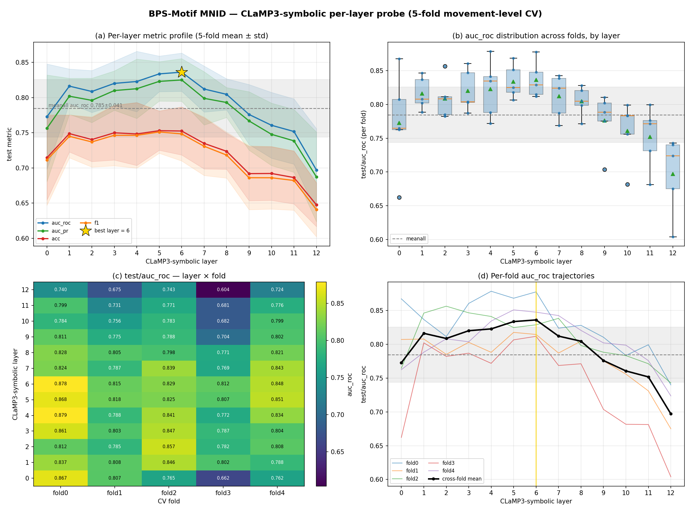
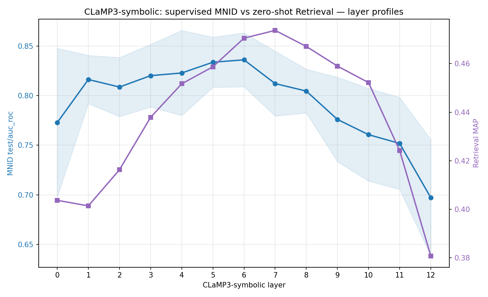

# BPS-Motif MNID — CLaMP3-symbolic layer sweep (5-fold CV)

**What:** a supervised probe of *where in CLaMP3's depth the motif signal lives*.
For every CLaMP3-symbolic layer (0–12) and every CV fold (0–4) we freeze the
encoder, train a small MLP head to classify **motif-window vs non-motif-window**
(MNID), and read the held-out test metrics. 5 folds × 13 layers = **65 probes**,
plus a `meanall` baseline (probe on the mean over all 13 layers) per fold.

This is the supervised companion to the zero-shot
[Retrieval layer sweep](bps_motif_retrieval_clamp3_layersweep.md). Together they
answer the question that actually matters for us: **which CLaMP3 layer should the
symbolic motif-discovery pipeline read, and how good is that representation?**

- Data: `Beethoven_motif` (BPS-Motif, Hsiao et al. ISMIR 2023) — 32 Beethoven
  first movements, movement-level 5-fold CV (seed 1234).
- Encoder: `CLaMP3_Symbolic_Encoder` (M3 backbone, 13 hidden layers, frozen).
- Probe: MLP `[256]`, 40 epochs, early-stop on `val/f1` (patience 7).
- Checkpoints: frozen encoder stripped on save (~0.9 MB/ckpt) → re-injected on load.
- Embedding cache (`(L=13,H=768)` per clip) is shared across all 13 layer-probes
  and meanall, so the encoder forward runs once per fold; the rest is MLP training.

Tools (committed): `scripts/sweeps/run_bps_mnid_folds.sh` (sweep),
`scripts/sweeps/bps_mnid_summary.py` (cross-fold aggregator → `docs/data/bps_mnid_summary.json`),
`scripts/sweeps/plot_bps_mnid.py` (figures). Raw per-fold numbers live in the JSON.

---

## TL;DR

1. **The motif signal peaks in the middle of the network.** `auc_roc` rises from
   0.77 (L0) to a **plateau at L5–L6 (0.834–0.836)**, then declines monotonically
   to 0.70 at L12. **Best layer = 6** (auc_roc 0.836 ± 0.027, acc 0.753, f1 0.748).
2. **The final layer is the *worst*.** L12 — the contrastive projection CLaMP3 was
   trained on for text↔music alignment — is the single weakest probe (auc_roc 0.697).
   The default "use the pooled output embedding" choice is the wrong one for motif work.
3. **Layer selection beats mean-pooling.** L6 beats `meanall` by **+0.052 auc_roc**
   (0.836 vs 0.785) and +0.054 auc_pr. Averaging dilutes the strong middle with the
   weak late layers.
4. **Supervised (MNID) and zero-shot (Retrieval) peak at adjacent depths** — L6 vs
   L7 — but with different *shapes*: MNID is good even at shallow layers, Retrieval
   needs depth (see §5). The discovery pipeline is retrieval-like → **read L6–L7**.



---

## 1. Per-layer profile (the headline)

`auc_roc`, cross-fold mean ± std (full table for all 6 metrics in the JSON):

| layer | auc_roc | auc_pr | acc | f1 | shape |
|---|---|---|---|---|---|
| 0  | 0.773 ± 0.075 | 0.757 | 0.715 | 0.711 | input embedding — weak, high-variance |
| 1  | 0.816 ± 0.024 | 0.802 | 0.749 | 0.745 | jumps immediately |
| 2  | 0.809 ± 0.030 | 0.796 | 0.740 | 0.737 | |
| 3  | 0.820 ± 0.032 | 0.810 | 0.750 | 0.747 | |
| 4  | 0.823 ± 0.043 | 0.813 | 0.748 | 0.746 | climbing |
| 5  | 0.834 ± 0.025 | 0.823 | 0.753 | 0.751 | plateau start |
| **6** | **0.836 ± 0.027** | **0.825** | **0.753** | 0.748 | **peak ⭐** |
| 7  | 0.812 ± 0.033 | 0.799 | 0.735 | 0.731 | rolling off |
| 8  | 0.805 ± 0.022 | 0.793 | 0.724 | 0.718 | |
| 9  | 0.776 ± 0.043 | 0.767 | 0.692 | 0.686 | decline |
| 10 | 0.761 ± 0.047 | 0.748 | 0.692 | 0.686 | |
| 11 | 0.752 ± 0.046 | 0.739 | 0.686 | 0.682 | |
| 12 | 0.697 ± 0.059 | 0.687 | 0.648 | 0.641 | projection head — worst |
| **meanall** | 0.785 ± 0.041 | 0.771 | 0.719 | 0.714 | mean-of-all-layers baseline |

**Why this shape?** It is the textbook transformer "concept-formation" curve:

- *Shallow layers (0–2)* hold mostly local/surface features (intervals, contour
  fragments). For a **supervised** head that's already enough to get to ~0.81
  auc_roc — a learned linear-ish boundary can exploit even raw features. Hence the
  near-vertical jump L0→L1.
- *Middle layers (4–7)* are where the encoder has composed those fragments into
  **motivic abstractions** — phrase-level identity that survives the surface
  variation a motif undergoes (transposition, rhythmic change). This is exactly the
  representation a motif task wants, and it's where both probes peak.
- *Late layers (9–12)* specialize toward CLaMP3's **training objective**: a global,
  cross-modal (text↔audio↔symbolic) **contrastive** embedding. That objective
  rewards collapsing a whole piece to one alignable vector and discards the
  fine-grained, *position-dependent* motif structure we care about. The monotone
  decline to L12 is the cost of that specialization.

---

## 2. Layer selection vs mean-pooling (`meanall`)

| metric | best layer (6) | meanall | Δ (best − meanall) |
|---|---|---|---|
| auc_roc | 0.836 | 0.785 | **+0.052** |
| auc_pr  | 0.825 | 0.771 | **+0.054** |
| acc     | 0.753 | 0.719 | +0.034 |
| f1      | 0.748 | 0.714 | +0.034 |

Mean-pooling all 13 layers throws away ~5 auc_roc points versus picking L6. The
late layers (9–12) are not just *less* useful, they actively drag the average down.
**Concretely: do not feed the discovery pipeline a mean-over-layers or the default
output embedding — select a single mid-layer.**

---

## 3. Distribution & fold variance (panels b–d)

- **Spread (panel b).** The L5–L6 boxes sit clearly above the rest with tight IQRs;
  the late layers both drop *and* widen. So the peak isn't a single-fold fluke — it
  is the reliably-best band.
- **The hard fold (panel c heatmap).** **Fold 3 is the hard split** — the darkest
  column at almost every layer (its L6 is 0.812 vs fold 0's 0.878). This is
  movement-level CV variance: some Beethoven movements have motifs that are harder
  to separate from their own non-motif material. Worth remembering when we read any
  single-fold number.
- **L0 is weak *and* unstable** (± 0.075; fold0 0.867 vs fold3 0.662, a 0.20 range).
  Raw input features generalize unevenly across movements — another reason to avoid
  shallow layers.
- **Peak is robust (panel d).** Every fold's trajectory bends down after L6–L7; the
  bold cross-fold mean peaks unambiguously at L6. No fold prefers a late layer.

---

## 4. Absolute level — how good is L6, really?

auc_roc 0.84 / acc 0.75 for motif-vs-non-motif **window** classification from a
*frozen* layer + a tiny head is a **strong** result: CLaMP3's L6 linearly encodes
most of what separates a motif occurrence from surrounding material. It is **not**
ceiling (0.84, not 0.95+) — there is residual structure a frozen layer + linear
head can't capture, which is the headroom a fine-tune (LoRA) or a contrastive
re-head would target.

---

## 5. MNID vs Retrieval — supervised separability vs zero-shot geometry



Overlaying the supervised MNID `auc_roc` against the zero-shot Retrieval `MAP`
(within-(piece,letter) nearest-neighbour, no training) is the most actionable plot
here:

| | peak layer | shape |
|---|---|---|
| **MNID** (supervised) | **L6** | high *everywhere* ≥ L1; broad plateau L4–6 |
| **Retrieval** (zero-shot) | **L7** | rises *slowly*, sharper single peak at L7 |

- **Same region, different ramps.** A supervised head extracts motif signal from
  even shallow layers (MNID L1 already 0.82). Zero-shot cosine retrieval cannot — it
  needs the deeper, better-*organized* geometry where like motifs actually sit near
  each other, so Retrieval keeps climbing to L7 before peaking.
- **Both collapse at L12** for the same reason (§1): the contrastive head is the
  wrong space for intra-piece motif geometry.
- **Implication:** our discovery pipeline is *unsupervised retrieval*, so it behaves
  like the purple curve. **L7 is the retrieval-optimal layer; L6 the supervised
  optimum; the L6–L7 band is the operating point.** Centering the retrieval space
  adds **+1.4 MAP points at every layer** (best: L7 centered, MAP 0.488 — see the
  retrieval doc) and costs nothing, so apply a common-mean subtraction too.

---

## 6. Implications for symbolic motif discovery (the point of all this)

We are building CLaMP3-based discovery of **leitmotifs / recurring themes in
symbolic game music** (BotW, Zelda, …). BPS-Motif (Beethoven) is the controlled
proxy with ground-truth motif labels. What this sweep tells the discovery pipeline:

1. **Switch the discovery embedding to CLaMP3 layer 7 (fallback L6), not the default
   output embedding.** The output/projection layer (L12) is empirically the *worst*
   for motifs. This is the single highest-leverage change and explains part of the
   leitmotifs within-piece **low-recall** symptom if it was ever run on the pooled
   output embedding — we were reading the most motif-agnostic layer.
2. **Select one layer; never mean-pool.** −0.05 auc_roc / similar MAP loss for
   averaging.
3. **Center the embedding space** (subtract the corpus/piece mean) before cosine —
   free retrieval gain, no whitening (whitening hurt; see retrieval doc).
4. **The representation is good but not magic.** Supervised separability is strong
   (0.84) yet zero-shot retrieval is only moderate (MAP ≈ 0.49). So the discovery
   *bottleneck is split*: a real chunk is the **representation/layer choice** (fixable
   now, this doc) and the rest is the **discovery algorithm** (granularity, within-
   piece nomination, NMS) — consistent with "embedding is a strong prior, not a
   ceiling." It refines the earlier "embedding is the ceiling" framing: the ceiling
   is *higher* than the final-layer embedding implied, once you pick the right layer.
5. **Domain-gap caveat.** BPS-Motif is classical Beethoven; game scores differ in
   orchestration, repetition idiom, and motif length. The *layer choice* (mid-network
   beats output) is an architectural property of CLaMP3 and should transfer; the
   *absolute* numbers will not. Validate L6–L7 on a small labelled game-music slice
   (e.g. the by-ear BotW motif annotations) before trusting magnitudes.

### Concrete next levers (in leverage order)

- **Re-extract leitmotifs discovery embeddings at CLaMP3 L7 (centered).** Cheapest,
  biggest expected win. Re-measure within-piece recall.
- **Then** revisit the discovery algorithm (bar-granularity, top-K cap, NMS radius)
  now that the representation is the right one.
- **Later** consider LoRA / a contrastive re-head on motif pairs to lift the 0.84
  supervised ceiling — but only after the free layer-selection win is banked.

---

## 7. Browsing the results

Three views, no ad-hoc scripting needed:

- **wandb (interactive):** in the `CLaMP3-symbolic / BPSMotifMNID` group, filter
  `job_type = test` (clean `test`/`fit` now) and **group by `sweep/layer`** →
  each row is the per-layer mean across its 5 folds, sortable by `test/auc_roc`.
  Every run carries `sweep/{layer,fold,stage,repr}` (stamped live by
  `LogSweepCoordsCallback`; historical runs backfilled via
  `fix_wandb_runs.py coords`).
- **Committed leaderboard:** `docs/data/bps_mnid_leaderboard.csv` — layers ranked
  best-first (regenerate with `bps_mnid_summary.py --out-csv`).
- **On disk:** per-fold dirs are layer-primary — `…-layers.layer{N}.fold{F}` — so
  `ls` groups all folds of a layer together.

## 8. Reproducibility

```bash
# sweep (PC, GPU): 5 folds x 13 layers, no meanall
bash scripts/sweeps/run_bps_mnid_folds.sh --accelerator gpu --concurrency 4
# meanall baseline, all 5 folds (fit+test per fold on the mean-over-layers probe)
for F in 0 1 2 3 4; do
  sed -e "s/fold_idx: 0/fold_idx: $F/g" \
      -e "s#CLaMP3-symbolic-meanall/#CLaMP3-symbolic-meanall.fold$F/#g" \
      configs/probe.CLaMP3-symbolic-meanall.BPSMotifMNID.yaml > configs/_bps_mnid_meanall_fold$F.yaml
  python cli.py fit  -c configs/_bps_mnid_meanall_fold$F.yaml
  python cli.py test -c configs/_bps_mnid_meanall_fold$F.yaml
done
# aggregate + plot
python scripts/sweeps/bps_mnid_summary.py --base ~/developer/marble \
    --out-json docs/data/bps_mnid_summary.json
python scripts/sweeps/plot_bps_mnid.py --json docs/data/bps_mnid_summary.json \
    --out docs/figures/bps_mnid_layers.png \
    --retrieval-json docs/data/bps_retrieval_maps.json \
    --out-cmp docs/figures/bps_mnid_vs_retrieval.png
```

**Known wrinkle (resume):** the fold driver writes per-fold dirs
`…-layers.fold{F}.layer{N}`, but the runner's skip check globs `…-layers.layer{N}`,
so completed layers are **not** skipped on a fold-driven re-launch (an interrupted
sweep re-runs from scratch rather than resuming). Harmless for a clean run; fix is
to make `_layer_done` fold-aware. Tracked, not yet fixed.
