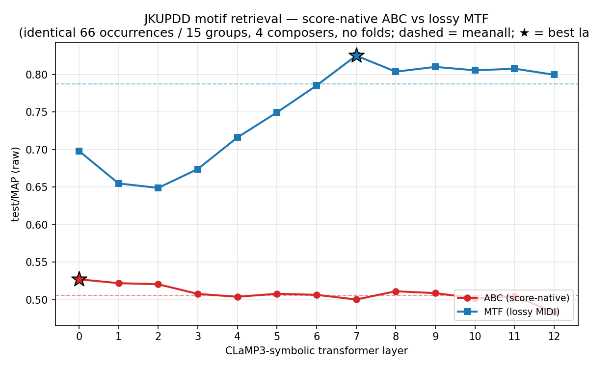

# JKUPDD motif retrieval — score-native **ABC** vs lossy **MIDI→MTF**

**Question.** CLaMP3-symbolic's M3 encoder was trained on two text views of
music: **MTF** (a lossless serialisation of MIDI *performance* — exact
ticks/velocities, message-segmented) and **interleaved ABC** (bar-segmented
*notation* — key, pitch spelling, meter, beaming, slurs, multi-voice). The
current JKUPDD/BPS-Motif pipelines feed MTF, produced by a lossy
`**kern → MIDI → MTF` round-trip. Does feeding **score-native ABC** instead —
sliced directly from the piece `**kern`, preserving the notation the MIDI
round-trip throws away — improve cross-piece motif retrieval?

**Answer: no — ABC is decisively worse on this task, and the result is clean.**
On the identical occurrence pool, score-native ABC scores **MAP 0.527 at its best
layer vs MTF's 0.825 (−0.298)**, and — unlike MTF — shows **no mid-stack peak**
(ABC's best layer is the *surface*, L0; its profile is flat). This is a
genuine negative result: for CLaMP3 motif retrieval the lossy-MIDI MTF path is
substantially better than the notation-faithful ABC path, and the
much-discussed "ABC-ify the whole symbolic line" idea does **not** pay off here.

## Setup — an apples-to-apples A/B on one occurrence pool

Both arms are zero-shot CLaMP3-symbolic per-layer sweeps (13 layers + a
mean-of-all-layers baseline, `max_epochs: 0`, no CV folds) over the **same
occurrence pool** with **identical `work_id`/relevance** (same
`(piece, annotator, pattern)` grouping, same `_work_id` hash). The only thing
that differs is the *input text* fed to the identical `M3Patchilizer.encode` →
CLaMP3 encoder:

- **MTF arm** (`JKUPDDRetrievalMatched`): each occurrence's lossy MIDI window →
  `midi_to_mtf` → patches. This is the existing pipeline, restricted to the
  aligned subset.
- **ABC arm** (`JKUPDDRetrievalABC`): each occurrence sliced from the piece
  `**kern` (converter21 → MusicXML → vendored xml2abc → abctoolkit interleave)
  → an interleaved-ABC string → patches.

The pool is the **66 occurrences / 15 groups** that survived ABC alignment (see
next section) — a strict subset of the dedup'd 78/20 MTF set the
[MTF leaderboard](jkupdd_retrieval_clamp3_layersweep.md) used. We re-ran the MTF
arm on exactly these 66 (emitted as `data/JKUPDD/JKUPDDRetrieval.matched.test.jsonl`
by the ABC builder) so the comparison is on one pool, not 66-ABC-vs-78-MTF.

Sanity check that the 66-subset is representative: the matched-MTF L7 MAP is
**0.825**, essentially the full-78 leaderboard's **0.843** — the subset behaves
like the whole, so the ABC↔MTF gap below is a representation effect, not a
pool artifact.

## Alignment — the doc's "clean/low-risk" claim is only ⅘ true (a real finding)

To build ABC per occurrence we map its JKUPDD point-set (the per-occurrence
`occurrences/csv/occN.csv`, rows `(ontime, midi)`) onto the piece `**kern`, then
slice the covered measure range. The bridge: parse the kern with converter21,
flatten to per-note `(offset, midi)`, calibrate the constant per-piece origin
shift between kern offset and point-set ontime (Bach +1.0; the pickup pieces
−1.0), and key every kern note by its `(ontime, midi)`. Each occurrence row is
then a direct lookup. We report a **per-occurrence note match-rate** and gate on
it (`--min-match-rate 0.9`).

`docs/kern_sourcing_bps_jkupdd.md` predicted JKUPDD would be **"clean / low-risk
— essentially a deterministic join."** In practice it is clean for **4 of 5
composers** but **breaks on the 5th**, for two reasons worth recording:

| piece | kern↔point-set pitch-agree | occ note match | status |
|---|---:|---:|---|
| Bach BWV 889 (fugue) | **1.000** | 21/21 perfect | clean (needed a `*staff` renumber — see below) |
| Chopin Op.24/4 (mazurka) | 0.994 | 22/22 (≥0.94) | clean |
| Mozart K.282/2 (menuetto) | 0.999 | 8/8 perfect | clean |
| Gibbons *Silver Swan* | 0.816 | 15/19 (4 dropped) | mostly clean |
| **Beethoven Op.2/1 mvt-3** | **0.003** | **0/8** | **dropped entirely** |

- **Beethoven is unusable.** converter21 parses this written-out-repeat Menuetto
  into a score whose every note's offset-in-hierarchy **collapses to a single
  value** (all −1.0) — the ontime bridge is then meaningless. The builder
  *detects* this degeneracy (a large fraction of notes sharing one offset) and
  **drops the piece with a clear reason** rather than silently mis-slicing. All
  8 Beethoven occurrences are lost.
- **The point-set is the *unfolded* performance; the kern is *folded* notation.**
  For the repeat-heavy pieces the ontime↔kern map is non-monotone past the first
  section, so a handful of occurrences that straddle a repeat boundary fall below
  the 0.9 gate (4 Gibbons `tomCollins` occurrences). This is the same
  fold/unfold hazard the doc flagged for BPS-Motif — it is present in JKUPDD too,
  contradicting the "low-risk" label.
- **Two smaller converter21 quirks, both handled.** (a) Bach's `wtc2f20.krn`
  shares a staff number across two spines (`*staff2 *staff1 *staff1`), which
  converter21 rejects; the builder renumbers to unique staves (changes layout,
  not pitch/rhythm) and Bach then aligns perfectly. (b) Six Beethoven slices
  (moot now Beethoven is dropped) hit a music21 `duplex-maxima` MusicXML-export
  bug on tie-straddling slices; the builder retries with `stripTies`.

**Net alignment outcome:** 66/78 occurrences aligned; **mean per-occurrence note
match-rate 0.967, 59/70 perfect (1.0)**; 15 groups, **no singletons** (every
surviving group still has ≥2 occurrences → a valid query pool). The ABC strings
themselves are high quality — proper interleaved voices, `K:`/`M:`/`Q:` headers,
dynamics, slurs, clef changes (verified by eye on Bach/Mozart/Chopin samples).
So ABC's underperformance below is **not** an artifact of broken ABC — the
notation is faithful; it simply embeds worse.

## Result — per-layer MAP, ABC vs MTF (identical 66-occurrence pool)

Raw `test/map` (Δ = ABC − MTF; positive would mean ABC helps):

| layer | ABC | MTF | Δ (ABC−MTF) |
|------:|----:|----:|------------:|
| 0 ⭐ABC | 0.5270 | 0.6980 | −0.1710 |
| 1  | 0.5219 | 0.6547 | −0.1328 |
| 2  | 0.5204 | 0.6488 | −0.1285 |
| 3  | 0.5076 | 0.6739 | −0.1663 |
| 4  | 0.5037 | 0.7160 | −0.2123 |
| 5  | 0.5078 | 0.7494 | −0.2417 |
| 6  | 0.5063 | 0.7852 | −0.2789 |
| **7** ⭐MTF | 0.5001 | **0.8250** | −0.3249 |
| 8  | 0.5111 | 0.8036 | −0.2924 |
| 9  | 0.5086 | 0.8100 | −0.3014 |
| 10 | 0.5018 | 0.8054 | −0.3036 |
| 11 | 0.5045 | 0.8076 | −0.3031 |
| 12 | 0.4831 | 0.7995 | −0.3164 |
| meanall | 0.5053 | 0.7873 | −0.2819 |



(Centered MAP tells the same story — every cell within ~0.01 of raw; full table
in `jkupdd_abc_vs_mtf_leaderboard.csv`.)

## The three questions, answered concretely

**(a) Does ABC beat MTF, and by how much at the peak?** **No — it loses by a
lot.** ABC's best layer (L0) is **0.527**; MTF's best (L7) is **0.825** — a
**−0.298 MAP peak gap**. At MTF's peak layer L7, ABC is **−0.325** below. There
is no layer at which ABC even approaches MTF: the *smallest* gap is **−0.13**
(at L1/L2, where MTF itself is in its surface trough), and it only widens as MTF
climbs its mid-stack.

**(b) Does the mid-stack peak land at the same layer?** **No — ABC has no
mid-stack peak at all.** MTF reproduces the canonical CLaMP3 depth signature: a
surface trough (L1/L2 ≈ 0.65) rising to a mid-stack peak (**L7 = 0.825**) then a
mild last-layer taper. ABC is **flat-to-declining** — best at the *surface*
(**L0 = 0.527**), drifting down to L12 = 0.483, with no interior maximum. The
notation representation never develops the mid-layer motif-identity signal that
makes MTF work. This is the most informative half of the result: it's not just
that ABC is a worse *input*, it's that ABC defeats the very depth mechanism the
[layer sweep](jkupdd_retrieval_clamp3_layersweep.md) and its BPS-Motif companion
identified as the actionable lever.

**(c) Is the peak sharper or flatter?** **Far flatter** — ABC's whole curve sits
in a 0.48–0.53 band (range 0.044) with no structure; MTF spans 0.65–0.825 with a
clear unimodal mid-stack peak. The ABC `meanall` (0.505) is indistinguishable
from its per-layer cells, i.e. *no layer carries useful extra signal over the
average* — the opposite of MTF, where L7 beats `meanall` by +0.038.

**Patch counts (the task's note).** ABC is bar-aligned and therefore *coarser*:
**median 21 patches/occurrence (mean 33)** vs MTF's message-segmented **median 32
(mean 50)** — MTF uses ~**1.65×** more patches. So ABC does **not** lose by
drowning the encoder in tokens; it loses with *fewer*, denser-per-bar patches.
The finer MTF event segmentation appears to be exactly what CLaMP3's motif signal
rides on.

**Secondary metrics (best layer each).** recall@1 ABC 0.153 vs MTF 0.254;
recall@5 ABC 0.487 vs MTF 0.758; recall@10 ABC 0.759 vs MTF 0.925. recall@50 =
1.000 for both (the 66-window pool is < 50 distractors per query, so top-50
trivially covers every relevant — read the lower-K recalls, not @50).

## Verdict

**Score-native ABC does not help cross-piece motif retrieval with CLaMP3 — it
hurts, decisively and at every layer, and it flattens away the mid-stack depth
peak that is the method's whole edge.** On a controlled 66-occurrence pool the
notation-faithful ABC path loses **~0.30 MAP** to the lossy MIDI→MTF path at the
peak (0.527 vs 0.825) and ~0.28 on the all-layer mean. The ABC strings are
high-fidelity (faithful key/meter/spelling/voices), so this is a property of how
CLaMP3 *represents* bar-segmented notation for short motif windows, not a build
artifact.

**Actionable take:** do **not** ABC-ify the JKUPDD/BPS-Motif symbolic line. Keep
MTF and a mid-layer (L7). The CLaMP3 symbolic encoder evidently extracts
motif-occurrence identity from the dense, message-segmented MIDI-performance view
far better than from the coarse, notation-rich bar view — at least for this
within-piece, cross-composer retrieval task on short windows. If ABC is ever
revisited, the hypotheses to test are (i) note-level rather than bar-level ABC
segmentation, and (ii) whether ABC's penalty shrinks on *longer* windows where a
bar patch is less of the whole.

## Caveats

- **Thin & saturated, like the MTF doc.** 66 windows, 15 groups, 4 composers, no
  folds → no error bars. The **direction** (ABC ≪ MTF, ABC flat vs MTF-peaked) is
  large and unambiguous; treat the **magnitudes** as directional. recall@50 = 1.0
  both arms confirms the pool is small/easy — the discriminating signal is in
  MAP and low-K recall.
- **Pool is the aligned subset, not all 78.** Beethoven (8 occ) is absent — its
  kern won't parse cleanly under converter21. The A/B is honest *on the 4
  composers that align*; a Beethoven result would need a different kern
  edition or a repeat-unfolding harness.
- **One encoder, one task.** This is CLaMP3-symbolic on within-piece JKUPDD
  retrieval. It does not by itself settle ABC-vs-MTF for *generation*,
  *classification*, or other encoders — only that, here, MTF wins and the
  mid-stack-layer finding is MTF-specific.

## Reproduce

```bash
cd ~/developer/python/marble    # PC: /home/sid/developer/marble (WSL)
# 0. source JKUPDD groundTruth occurrence CSVs (sparse, blobless — the full
#    clone is ~hundreds of MB; we only need the per-occurrence point-set CSVs):
git clone --filter=blob:none --sparse \
    https://github.com/ns2max/jkupdd_dataset.git data/kern_sources/jkupdd_sparse
( cd data/kern_sources/jkupdd_sparse && \
  git sparse-checkout set --no-cone \
    "groundTruth/*/*/repeatedPatterns/*/*/occurrences/csv/*.csv" )
#    the per-piece **kern + full-piece point-set live under data/kern_sources/JKUPDD/

# 1. build the ABC set + the matched-MTF subset (mirrors the dedup'd MTF identity):
uv run python scripts/data/build_jkupdd_abc.py \
    --jkupdd-root data/kern_sources/jkupdd_sparse \
    --kern-dir    data/kern_sources/JKUPDD       # --min-match-rate 0.9 (default)

# 2. both 13-layer + meanall sweeps (zero-shot, CUDA, ~4 min each):
.venv/bin/python scripts/sweeps/run_sweep_local.py \
    --base-config configs/probe.CLaMP3-symbolic-layers.JKUPDDRetrievalABC.yaml \
    --num-layers 13 --model-tag CLaMP3-symbolic --task-tag JKUPDDRetrievalABC \
    --accelerator gpu --skip-fit-if-no-train --concurrency 2
.venv/bin/python scripts/sweeps/run_sweep_local.py \
    --base-config configs/probe.CLaMP3-symbolic-layers.JKUPDDRetrievalMatched.yaml \
    --num-layers 13 --model-tag CLaMP3-symbolic --task-tag JKUPDDRetrievalMatched \
    --accelerator gpu --skip-fit-if-no-train --concurrency 2
# backfill wandb sweep coords (idempotent — the live callback already stamps them):
.venv/bin/python scripts/analysis/fix_wandb_runs.py --apply coords \
    --group "CLaMP3-symbolic / JKUPDDRetrievalABC"
.venv/bin/python scripts/analysis/fix_wandb_runs.py --apply coords \
    --group "CLaMP3-symbolic / JKUPDDRetrievalMatched"

# 3. aggregate the A/B + figure:
.venv/bin/python scripts/sweeps/jkupdd_abc_vs_mtf_summary.py \
    --out-csv docs/jkupdd_abc_vs_mtf_leaderboard.csv
.venv/bin/python scripts/sweeps/plot_jkupdd_abc_vs_mtf.py \
    --csv docs/jkupdd_abc_vs_mtf_leaderboard.csv --out docs/jkupdd_abc_vs_mtf.png
```

wandb: project `marble`, groups `CLaMP3-symbolic / JKUPDDRetrievalABC` and
`CLaMP3-symbolic / JKUPDDRetrievalMatched` (14 runs each).

Claude-Session: https://claude.ai/code/session_018p1T4iWsECNA4NtQe7XNGd
