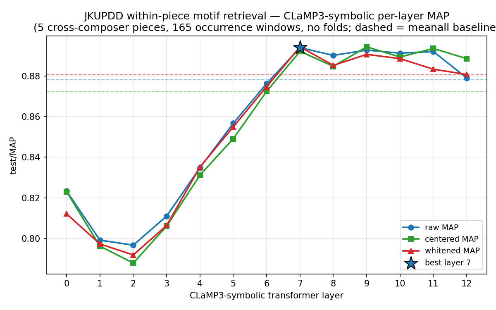

# JKUPDD Retrieval — CLaMP3-symbolic layer sweep

Within-piece motif **retrieval** on **JKUPDD** (JKU Patterns Development
Database, Collins 2013): the canonical MIREX motif-discovery ground truth, **5
cross-composer pieces** — J.S. Bach (BWV 889 fugue), Beethoven (Op. 2 No. 1, mvt
3), Chopin (Op. 24 No. 4 mazurka), Gibbons (*Silver Swan*), Mozart (K. 282, mvt
2). Zero-shot probe of CLaMP3-symbolic: embed every annotated
pattern-occurrence window, rank by cosine, score relevance as **same
`(piece, annotator, pattern)` group**.

This is the **cross-composer companion** to
[`bps_motif_retrieval_clamp3_layersweep.md`](bps_motif_retrieval_clamp3_layersweep.md)
(Beethoven-only, 32 sonatas). Its job is to test whether that sweep's headline —
**mid-layers L6/L7 ≫ final layer L12** — is a Beethoven artifact or a property
of CLaMP3's depth that holds across composers and eras (Baroque → Classical →
Romantic).

## Run

- **13 layers × 1 run + 1 meanall = 14 runs**, all completed (rc=0), ~4 min wall
  on an RTX 5060 Ti (CUDA). Zero-shot (`max_epochs: 0`) → **no checkpoints**;
  the encoder forwards the 165 windows once, the 13 layer-jobs read the `(L, H)`
  embedding cache.
- **No CV folds.** JKUPDD is small (32 annotated patterns / 165 occurrences),
  and motif identity is within-piece, so the whole benchmark is **one test
  set** — there is exactly one run per layer (contrast BPS-Motif's 5 folds).
- Date: 2026-06-21. wandb: project `marble`, group
  `CLaMP3-symbolic / JKUPDDRetrieval`, names `layer-0-test` … `layer-12-test` +
  `layer-meanall-test`. Sweep coords (`sweep/layer`, `sweep/stage`) logged at run
  time via `LogSweepCoordsCallback`.
- Full metric suite via `log_extended_retrieval_metrics: true`.



## Results — `test/map` by layer: raw | centered | whitened

| layer | raw | centered | whitened |
|------:|----:|---------:|---------:|
| 0  | 0.8233 | 0.8230 | 0.8121 |
| 1  | 0.7992 | 0.7962 | 0.7973 |
| 2  | 0.7967 | 0.7879 | 0.7919 |
| 3  | 0.8110 | 0.8061 | 0.8064 |
| 4  | 0.8348 | 0.8312 | 0.8352 |
| 5  | 0.8567 | 0.8491 | 0.8550 |
| 6  | 0.8762 | 0.8724 | 0.8747 |
| **7**  | **0.8939** | **0.8921** | **0.8943** |
| 8  | 0.8901 | 0.8847 | 0.8852 |
| 9  | 0.8927 | 0.8943 | 0.8906 |
| 10 | 0.8912 | 0.8893 | 0.8885 |
| 11 | 0.8920 | 0.8935 | 0.8833 |
| 12 | 0.8790 | 0.8885 | 0.8807 |
| **meanall** | 0.8780 | 0.8723 | 0.8808 |

**Best layer: 7 (MAP 0.8939 raw, 0.8921 centered).** Beats `meanall` by +0.016
raw / +0.020 centered.

## Does L6/7 peak + L12 collapse hold on this 5-composer set?

**The peak generalizes; the collapse does not.**

1. **Mid-layer peak — YES, and at the *same depth*.** The raw-MAP maximum is at
   **layer 7**, identical to BPS-Motif's best layer (7). Layers rise
   monotonically from a L1/L2 trough (0.797) to the L7 peak (0.894). The
   *location* of the motif-identity signal — mid-stack, around layer 7 — is
   **reproduced across composers and eras**, not a Beethoven artifact. This is
   the load-bearing cross-validation of the BPS finding.

2. **Last-layer collapse — NO, only a mild taper.** On BPS-Motif, L12 was the
   *worst* layer (0.381, a −0.093 / −20% drop from the L7 peak). On JKUPDD, L12
   is **0.879 — barely below the peak** (−0.015, −1.7%) and still **above
   `meanall`**. There is a high plateau across L7–L11 (0.890–0.894) and only a
   gentle dip at L12, not a collapse. CLaMP3's final-layer specialization for its
   *global contrastive* objective clearly *does* cost motif-occurrence locality
   (the L12 taper is real and consistent in direction), but on JKUPDD's tiny,
   easy pool it costs ~1 MAP point, not ~9.

3. **Why the discrepancy is expected (and not a contradiction).** JKUPDD is
   **statistically thin and easy**: 165 windows, no folds, and per-piece relevant
   sets of ~5–14 occurrences (vs BPS-Motif's long occurrence tails of dozens).
   With so few distractors, MAP saturates near 0.9 at *every* layer (the floor is
   0.797, not ~0.4), which **compresses the whole curve** and shrinks every
   inter-layer gap — including L12's. The differences are directional, not
   precise. **Read JKUPDD for the cross-composer *shape* (peak location,
   monotone rise, last-layer taper direction), not the magnitudes.** On *shape*,
   it agrees with BPS-Motif: mid-stack peak at L7, weakest at the surface
   (L1/L2), final layer below the peak.

**Verdict:** the BPS-Motif depth finding **partially generalizes**. The
actionable half — *use a mid-layer (L7), not the all-layer mean or the final
layer* — holds across composers. The dramatic L12 collapse is BPS-specific in
*magnitude* (driven by hard, long occurrence tails) but consistent in
*direction* (L12 < peak everywhere).

## raw vs centered vs whitened

Unlike BPS-Motif — where **centering won at every layer** — on JKUPDD the three
variants are **within ~0.01 MAP of each other at every layer** and trade the lead
back and forth (raw best at L0–8, centered at L9/L11/L12, whitened occasionally
on top). With only 165 windows and a single pool, the anisotropy estimate is too
noisy for centering/whitening to do reliable work; the post-hoc transforms are a
**wash** here. Use **raw, layer 7**. (The centering benefit on BPS-Motif came
from much larger per-fold pools where the common-mean direction is well
estimated.)

## recall@K + secondary metrics (best layer 7)

| K | raw | centered | whitened |
|---:|----:|---------:|---------:|
| 1   | 0.2682 | 0.2682 | 0.2694 |
| 5   | 0.6973 | 0.6961 | 0.6899 |
| 10  | 0.8764 | 0.8686 | 0.8840 |
| 50  | 1.0000 | 1.0000 | 1.0000 |
| 100 | 1.0000 | 1.0000 | 1.0000 |

| metric | raw / centered / whitened | reading |
|---|---|---|
| `map` | 0.8939 / 0.8921 / 0.8943 | near-saturated on this easy pool |
| `r_precision` | 0.8638 / 0.8578 / 0.8557 | ~86% of relevant retrieved at the R cutoff |
| `median_rank` | 1.0 / 1.0 / 1.0 | first relevant hit is always rank 1 |
| `mrr` | 0.9448 / 0.9445 / 0.9502 | first hit at avg rank ≈ 1.06 |
| `map@1` / `recall@1` | 0.2682 / 0.2682 / 0.2694 | top-1 ≈ 1/R of the occurrence set |
| `hit_rate@10` | 1.0 / 1.0 / 1.0 | every query has ≥1 relevant in top-10 |

**recall@50 = recall@100 = 1.0** — with only ~165 windows total, the top-50
always contains *every* same-pattern occurrence. This is the small-pool effect
in numbers: JKUPDD measures *peak location*, not the occurrence-tail recall that
makes BPS-Motif (recall@100 only ~0.61) the harder, more discriminating
benchmark. The two are complementary: JKUPDD = cross-composer breadth, BPS-Motif
= occurrence-tail depth.

## Caveats

- **Statistically thin.** 165 items, 32 patterns, 5 pieces, **no folds** → no
  error bars. Treat every number as **directional**. The value is the
  **cross-composer spread** (does the *shape* survive a 5-composer, 4-century
  set?), not precision.
- **Easy pool → saturated MAP.** Few distractors compress the layer curve; gaps
  here are ~⅕ the size of BPS-Motif's. Don't compare JKUPDD and BPS-Motif MAP
  *magnitudes* — only their *shapes*.
- Symbolic only (CLaMP3-symbolic, MIDI→MTF→M3 tokenisation); one clip-level
  vector per occurrence window (`TimeAvgPool` over patches, single layer).
- JKUPDD annotators differ per piece (the `(piece, annotator, pattern)` key keeps
  each annotator's patterns as a separate relevance group, so cross-annotator
  overlap is correctly *not* counted as relevant).

## Reproduce

```bash
cd ~/developer/python/marble    # PC: /home/sid/developer/marble (WSL)
# 13 layers + meanall on a CUDA box (~4 min, zero-shot):
.venv/bin/python scripts/sweeps/run_sweep_local.py \
  --base-config configs/probe.CLaMP3-symbolic-layers.JKUPDDRetrieval.yaml \
  --num-layers 13 --model-tag CLaMP3-symbolic --task-tag JKUPDDRetrieval \
  --accelerator gpu --skip-fit-if-no-train
# aggregate (no folds → one run per layer):
.venv/bin/python scripts/sweeps/jkupdd_retrieval_summary.py \
  --out-csv docs/jkupdd_retrieval_clamp3_leaderboard.csv
# per-layer MAP figure:
.venv/bin/python scripts/sweeps/plot_jkupdd_retrieval.py \
  --csv docs/jkupdd_retrieval_clamp3_leaderboard.csv \
  --out docs/jkupdd_retrieval_clamp3_layersweep.png
```

Requires the `symbolic-midi` extra and the built dataset under `data/JKUPDD/`
(`scripts/data/build_jkupdd_retrieval.py --jkupdd-root <path>`).
