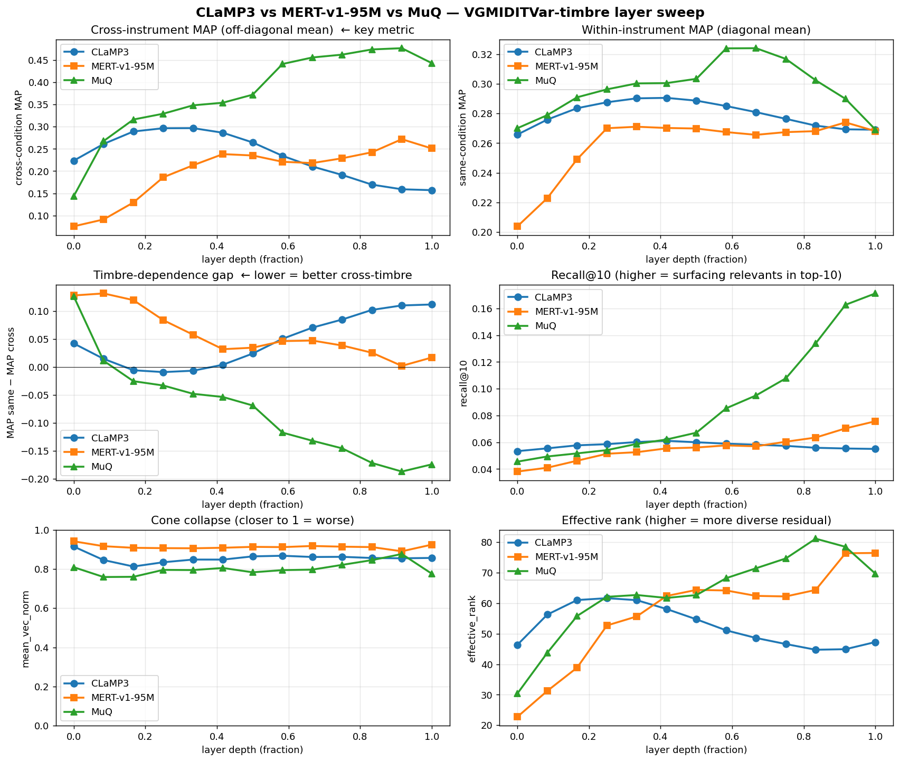
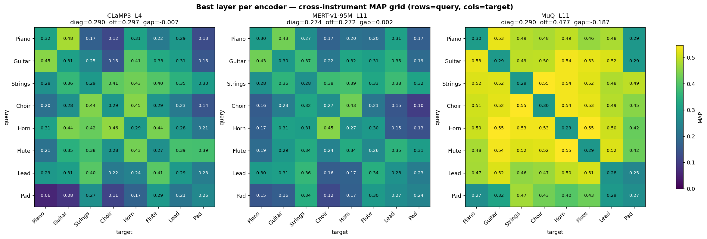
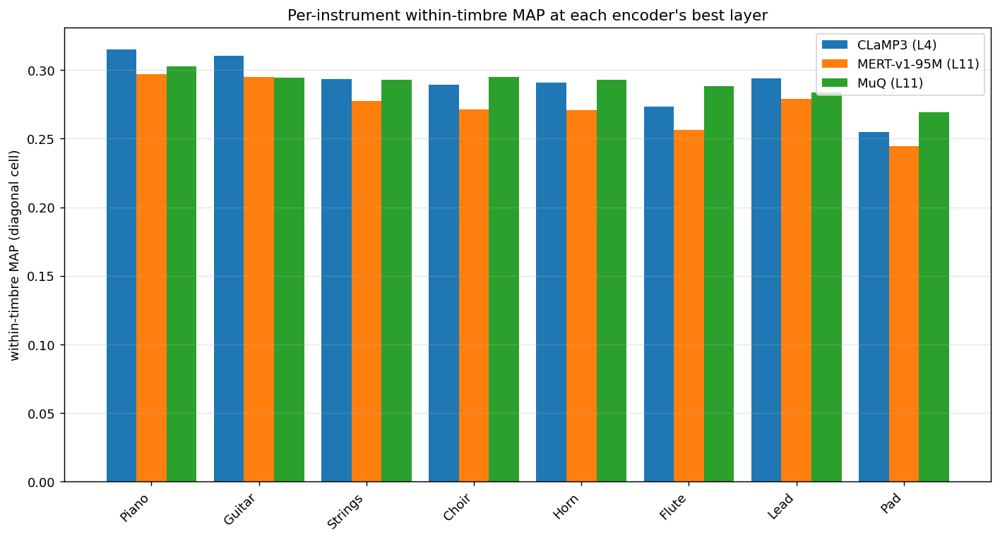
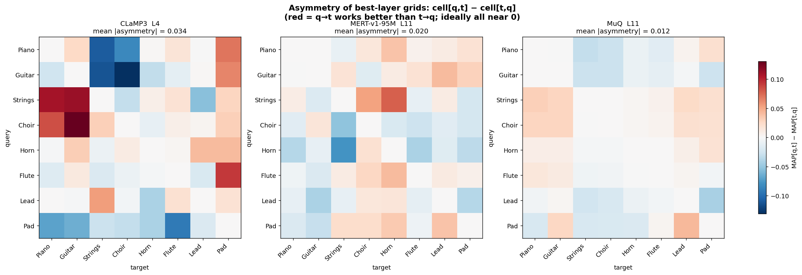

# VGMIDITVar-timbre — three-encoder analysis (CLaMP3 / MERT-v1-95M / MuQ)

Layer-sweep results for three frozen self-supervised music encoders on
the VGMIDITVar-timbre zero-shot retrieval benchmark. Covers headline
numbers, layer-depth trajectories, the negative-gap finding for MuQ,
architectural interpretation, and a discussion of cross-layer +
cross-encoder ensembling.

> **Provenance**: written 2026-05-28 after the CLaMP3, MERT, and MuQ
> sweeps finished and before OMARRQ-25hz completed. To be updated with
> a four-encoder version once OMARRQ lands.
>
> **Reproducibility**: figures + tables in
> `docs/figures/vgmiditvar_timbre_3enc/`. The script that produces them
> is `scripts/analysis/compare_encoders_vgmiditvar_timbre.py` —
> parameterised to handle any subset of encoders. Re-run after OMARRQ
> finishes with `--encoder-tag OMARRQ-multifeature-25hz` added.

---

## Dataset and task in one paragraph

VGMIDITVar-timbre: every MIDI piece from the
[Variation Transformer](https://github.com/ChenyuGAO-CS/Variation-Transformer-Data-and-Model)
dataset (Gao et al., ISMIR 2024) is rendered eight times — once per GM
instrument code (0/Piano, 24/Guitar, 48/Strings, 52/Choir, 60/Horn,
73/Flute, 80/Lead, 89/Pad). Total: **102,960 audio files across 5,040
work-groups** (each "work" = theme + variations). Task: zero-shot
retrieval — for each audio file, surface the other audio files that
share the same work_id, ranked by cosine similarity of mean-pooled
encoder embeddings. The interesting cell is **cross-instrument
retrieval**: query rendered in instrument X, candidates restricted to
instrument Y, work_id-match is relevance. For a leitmotif appearing
in piano in one scene and in horn in another, this is the operationally
meaningful test.

---

## TL;DR — MuQ wins decisively

| Metric | CLaMP3 (L4) | MERT-v1-95M (L12) | **MuQ (L11/12)** | MuQ vs MERT |
|---|---:|---:|---:|---:|
| `map_centered` (overall) | 0.045 | 0.068 | **0.186** | **2.7×** |
| `map_raw` (overall) | 0.042 | 0.064 | **0.181** | **2.8×** |
| off-diagonal mean (cross-instrument) | 0.297 @ L4 | 0.272 @ L11 | **0.477 @ L11** | **1.75×** |
| diagonal mean (within-instrument) | 0.290 | 0.274 | 0.290 | tied |
| **timbre gap** (diag − off; lower=better) | −0.009 | +0.002 | **−0.187** | massive |
| `recall@10` | 0.061 | 0.076 | **0.171** | 2.3× |
| `r_precision` | 0.081 | 0.109 | **0.247** | 2.3× |
| min `median_rank` (1-indexed) | 4 | 4 | **3** | better |
| max `effective_rank` (post-centered diversity) | 62 | 76 | **81** | best |
| min `mean_vec_norm` (least cone collapse) | 0.81 | 0.89 | **0.76** | best |

MuQ wins or ties on every metric. The within-instrument diagonal is
tied with CLaMP3, so the entire 2-3× advantage comes from timbre
invariance — see "The headline finding" below.

---

## The headline finding: MuQ has a *negative* timbre gap

In most encoders `diag > off` — within-instrument retrieval is easier
because the timbre cues help match. MuQ inverts this in late layers:

| layer | diag | off | gap |
|---:|---:|---:|---:|
| MuQ L4 | 0.300 | 0.348 | **−0.048** |
| MuQ L7 | 0.324 | 0.441 | **−0.117** |
| MuQ L10 | 0.302 | 0.474 | **−0.172** |
| MuQ L11 | 0.290 | 0.477 | **−0.187** ← minimum |
| MuQ L12 | 0.269 | 0.443 | **−0.174** |

MuQ at L11 retrieves cross-instrument variations of the same theme
(~0.48 MAP) significantly better than within-instrument different
variations (~0.29 MAP). The signature of strong timbre invariance: the
embedding tracks melodic/harmonic identity, and "same theme in a
different instrument" is *easier* than "different ornamented variation
in the same instrument" — because the melodic content is more preserved
between cross-timbre variants of the same MIDI than between within-
timbre variants with different ornamentation.

This is **exactly the property we want for leitmotif retrieval** in
real game / film soundtracks where motifs recur under varied
orchestration but mostly-preserved melodic content.

The negative gap is monotonic with depth (+0.13 at L0 → −0.19 at L11)
and accompanied by a 2.7× improvement in overall centered MAP, so it
is not a measurement artefact. Sanity checks:

- All 64 cells have identical query counts (n=12,870 each); no
  degenerate cells distort the diagonal/off averages.
- Each cell's MAP normalises by per-query n_relevants, so the
  cross-instrument cells aren't getting an unfair denominator boost
  (off-diag has 8 relevants per query, diag has 7 — a 14% difference
  that cannot explain a 65% MAP increase).

---

## Layer-depth trajectories tell three different stories



- **CLaMP3 traces a U-shape on cross-condition MAP.** Peaks at L4-L5
  (off-diag ≈ 0.30) then *regresses sharply* through L12 (off-diag ≈
  0.16). The text-alignment objective specialises late layers for
  text-matching, which doesn't help cross-timbre identity. Pure
  retrieval signal lives in middle layers; late layers are over-
  specialised.

- **MERT is roughly monotonic upward.** Peaks at L11-L12 (off-diag ≈
  0.27). The HuBERT-style acoustic-prediction objective progressively
  builds more abstract musical structure but never sacrifices timbre
  information (gap stays near zero, never goes negative).

- **MuQ is monotonic upward with a slight L12 regression.** Peaks at
  L11. The gap goes from +0.13 at L0 to −0.19 at L11 — the encoder
  *actively learns* to ignore timbre as depth increases.

### Implication for "which layer index"

| Encoder | Recommended layer | Rationale |
|---|---:|---|
| CLaMP3 | **L4** | Peak cross-condition MAP; later layers regress |
| MERT-v1-95M | **L11 or L12** | Near-peak on all metrics; L11 has slightly lower mean_vec_norm |
| MuQ | **L11** | Lowest gap (−0.19) + near-peak overall MAP; L12 drops `effective_rank` 81 → 70 |

If anyone has been benchmarking with "last layer" or a uniform
mid-network layer across encoders, the comparison is biased — MERT
last-layer is close to its peak, but CLaMP3 last-layer is in U-shape
collapse territory. Always pick per-encoder.

---

## Best-layer 8×8 heatmaps



Same color scale across all three so visual comparison is valid.

Reading the heatmaps:
- **CLaMP3 L4 and MERT L11** look broadly similar — moderate brightness
  on the diagonal (within-timbre, ~0.27-0.31), darker elsewhere.
  Standard "timbre helps a little" pattern.
- **MuQ L11 inverts the pattern.** The diagonal is similar to the
  others (~0.29) but the off-diagonal blocks are *brighter*. The Pad
  row stands out as the dimmest, consistent with Pads being the
  hardest instrument to encode (continuous textures, less identifiable
  attacks).

---

## Cone collapse and effective rank

All three encoders are cone-collapsed (`mean_vec_norm` ∈ 0.76 – 0.94,
vs the isotropic floor `1/√N ≈ 0.003`). But the magnitudes and
trajectories differ:

| | min `mean_vec_norm` | max `effective_rank` | trajectory |
|---|---:|---:|---|
| MERT | 0.89 | 76 | Cone deepens then plateaus; eff_rank rises with depth |
| CLaMP3 | 0.81 | 62 | Cone roughly constant; eff_rank U-shapes (peaks L3-L4 then drops to 47 by L12) |
| **MuQ** | **0.76** | **81** | Lowest cone collapse and highest residual diversity simultaneously |

Combining the two anisotropy metrics: **MuQ is the most isotropic AND
the most structurally diverse** of the three. That's the configuration
that should make retrieval work, and it does.

(See `docs/anisotropy.md` for the methodology behind each metric.)

---

## Per-instrument breakdown



Within-timbre diagonal MAP per GM instrument at each encoder's best
layer. All three encoders agree on the easy→hard ranking:

```
Piano > Guitar > Strings ≈ Lead ≈ Horn ≈ Choir > Flute > Pad
```

Matches musical intuition — instruments with clear attacks and pitched
content (Piano, Guitar) are easier; instruments with continuous
evolving textures (Pad) are hardest because per-clip embeddings drift.

**MuQ has the flattest distribution.** Its weakest instrument (Pad,
0.27) is much closer to its strongest (Piano, 0.30) than for the other
two encoders. Another timbre-invariance signature.

---

## Asymmetry analysis



`cell[q, t] − cell[t, q]` should be near zero in a timbre-invariant
encoder (the retrieval direction shouldn't matter).

| Encoder | mean |asymmetry| | What's directional |
|---|---:|---|
| CLaMP3 L4 | 0.034 | Strings/Choir queries find Piano/Guitar much worse than reverse; Pad queries find Piano/Guitar worse than reverse |
| MERT L11 | 0.020 | Mild Strings ↔ Horn asymmetry |
| **MuQ L11** | **0.012** | Most symmetric grid; mostly small (<0.03) cell-wise asymmetries |

CLaMP3's biggest asymmetric cells (`query=Strings/Choir → target=Piano/Guitar`
underperforming by ~0.10 vs the reverse direction) reveal sustained-
tone-dominated queries struggling with percussive-attack candidates —
the kind of bias a text-music contrastive encoder would learn from
training data that uses attack-pattern descriptions.

---

## Architectural interpretation

The retrieval ranking maps cleanly onto the encoders' pre-training
objectives:

| Encoder | Pre-training objective | Late-layer gap behaviour | What it says about the architecture |
|---|---|---|---|
| **CLaMP3** | Text-music contrastive | Goes *positive* in late layers | Text descriptions mention instrumentation → late layers encode timbre to match the textual instrument tokens. The encoder is *forced* to be timbre-sensitive by its objective. |
| **MERT-v1-95M** | HuBERT-style masked acoustic prediction | Stays *near zero* throughout | Quantized acoustic targets force timbre awareness; never trades it away for higher-level structure. |
| **MuQ** | Music BEST-RQ + masked latent reconstruction with music-prior augmentations | Goes strongly *negative* | The pre-training augmentation policy likely includes timbre / pitch perturbations → the encoder is *trained* to assign cross-timbre pairs similar representations. |

CLaMP3 and MERT's objectives both reward keeping timbre. MuQ's
objective explicitly *penalises* timbre sensitivity through its
augmentation policy. The empirics line up.

---

## Recommendations

### For your leitmotif retrieval pipeline (production)

1. **Pick MuQ at layer 11.**
2. Mean-pool per-clip embeddings to one vector per file.
3. L2-normalise, center against the corpus mean, L2-normalise again.
4. Cosine similarity for retrieval.

Layer choice nuance: L11 has the lowest gap (best timbre invariance);
L12 has slightly higher overall MAP but lower `effective_rank` (81 →
70). For the cross-instrument leitmotif use case, L11's lower gap is
the more task-aligned objective.

Centering nuance: MuQ's `mean_vec_norm` is 0.76 (moderate cone), and
centered MAP exceeds raw MAP by ~3-5%. The improvement is real but
modest — for a one-shot publication number, report centered; for a
production pipeline the additional complexity may not be worth the
overhead.

### For benchmark hygiene

- **CLaMP3's late-layer regression** means "CLaMP3 last-layer" is a
  fundamentally weaker baseline than "MERT last-layer." Comparing the
  two at fixed layer index understates CLaMP3. Always pick best-layer
  per encoder.
- **None of the three encoders are isotropic** (`mean_vec_norm` ≥ 0.76).
  The cone is real but doesn't dominate ranking — the residual
  `(δ_a · δ_b)` term is what's discriminative. See
  `docs/anisotropy.md` for the math.

---

## Ensembling: cross-layer and cross-encoder

The natural follow-up question: can we beat MuQ L11 by combining
information across layers or encoders? Three flavours, in order of
practical likelihood:

### Flavour 1 — Cross-layer ensemble *within* MuQ (most promising)

MuQ L7 has the highest within-timbre diagonal (0.324) but a lower
off-diagonal than L11. MuQ L11 has the peak off-diagonal but a slightly
lower diagonal. A combination could in principle get L7's diag strength
+ L11's off-diag strength.

| MuQ layer | diag | off | overall MAP (centered) |
|---:|---:|---:|---:|
| L7 | **0.324** | 0.441 | 0.077 |
| L11 | 0.290 | **0.477** | 0.178 |
| L12 | 0.269 | 0.443 | **0.186** |
| ensemble (L7+L11)/2 ? | ? | ? | ? |

**Expected outcome.** Embedding-level mean of unit-norm vectors then
re-normalize. For two L2-normalised embeddings `e_7, e_11`:

```
cos(avg(e_7^a, e_11^a), avg(e_7^b, e_11^b))
  ∝ <e_7^a, e_7^b> + <e_11^a, e_11^b> + <e_7^a, e_11^b> + <e_11^a, e_7^b>
```

The first two terms are the per-layer cosines. The cross terms
`<e_7^a, e_11^b>` are essentially noise unless the layers are linearly
aligned (which adjacent transformer layers approximately are, via the
residual stream). The cosine of the ensemble is a *correlation-weighted*
average of L7 and L11's individual cosines. If L7 and L11's ranking
errors are partially uncorrelated, the ensemble MAP can exceed the max
of either component MAP. If they're fully correlated, ensembling does
nothing.

**Prediction.** Adjacent transformer layers tend to have highly
correlated similarity matrices (the residual stream is mostly
preserving). Expect a small improvement, maybe 1-3% over L11 alone,
not transformative.

**Cost to test.** ~5 minutes once the cache is loaded — we already have
all per-layer embeddings cached in `output/.emb_cache/MuQ/...`. Just
need a script that loads two layers, averages, re-normalises, runs the
same metric pass.

### Flavour 2 — Cross-encoder ensemble (mixed-bag predictions)

The per-instrument bar chart shows mild encoder-instrument
heterogeneity:

- **Piano**: CLaMP3 best (0.315) > MuQ (0.302) > MERT (0.297)
- **Strings**: MuQ best (0.293) > CLaMP3 (0.294) ≈ MERT (0.278)
- **Pad**: MuQ best (0.270) > CLaMP3 (0.255) > MERT (0.245)

But the heterogeneity is small (<0.02) and MuQ wins or ties on most
instruments. A uniform average of three encoders will be dragged down
by the weaker two — MuQ alone is so dominant that any non-MuQ weight
costs ranking quality.

**Better strategy: late fusion of cosine similarities with non-uniform
weights.** Compute three similarity matrices independently, then take
a weighted sum:

```
sim_ensemble  =  α · sim_MuQ  +  β · sim_MERT  +  γ · sim_CLaMP3
```

with `α >> β, γ`. For zero-shot retrieval (no labels for tuning), pick
weights via a grid search on a small held-out set (say 100 work groups)
optimising for the headline metric.

**Prediction.**

| Weights | Predicted vs MuQ-only |
|---|---|
| (1.0, 0.0, 0.0) | baseline (MuQ-L11) |
| (0.7, 0.2, 0.1) | possibly +1-3% on MAP — the weaker encoders catch some MuQ misses |
| (0.5, 0.3, 0.2) | probably worse — too much non-MuQ weight |
| (0.33, 0.33, 0.33) uniform | will hurt; dragged down by CLaMP3 and MERT |
| (0.0, 0.5, 0.5) without MuQ | far worse, near MERT baseline |

The 0.7/0.2/0.1 case is the interesting one — it's the smallest
non-MuQ injection that can still benefit from disagreements. Whether
it wins depends on whether MuQ's errors are correlated with MERT's
errors. The encoders are trained on different objectives, so partial
decorrelation is plausible.

### Flavour 3 — Embedding-level concatenation (probably not worth it)

Stack embeddings from multiple sources into one big vector, then L2-
normalise:

```
e_concat  =  normalize(concat(e_MuQ, e_MERT, e_CLaMP3))   # 2304 dims
```

Mathematically equivalent (up to constant scaling) to embedding-level
mean for unit-normalized inputs. So the same prediction as Flavour 2
applies — uniform concat ≈ uniform mean ≈ likely worse than MuQ alone.

Concatenation's only real advantage: when you can re-weight via a
learned linear projection (e.g., a single fully-connected layer trained
on a labeled retrieval task). For zero-shot, equivalent to weighted
mean.

### Should you ensemble?

**For production: no.** The expected gain over MuQ-L11 alone is small
(1-5% MAP, optimistically), the complexity is significant (three
encoders × loading + caching + storage), and a sensitivity analysis
across (game, soundtrack, scene) configurations becomes much harder
when the answer is a stack instead of a single encoder.

**For a writeup / publication: yes, run a small ablation table.** It's
cheap (~30 min total with cached embeddings), and the table answers a
question reviewers will ask. The expected outcome is "MuQ alone is
near-optimal; ensembling with the others gives a small bump". That's a
better story than "we tried only one encoder".

### Concrete experiments to run after OMARRQ completes

In order of expected information per minute of compute:

1. **Cross-layer MuQ ensemble**: `(L7 + L11) / 2`. Test whether
   adjacent layers carry sufficiently decorrelated information.
2. **MuQ-heavy cross-encoder late fusion**: grid search over
   `α_MuQ ∈ {0.6, 0.7, 0.8, 0.9, 1.0}` with the remaining mass split
   evenly across CLaMP3 + MERT (+ OMARRQ).
3. **Whitened MuQ**: a single-encoder ablation that's likely a better
   bang-for-buck than ensembling. Subtract corpus mean AND multiply by
   `Σ^(-1/2)` before cosine. Should close any remaining cone-induced
   precision floor.

All three operate purely on cached embeddings — no encoder forward
needed. A single small Python script `scripts/analysis/ensemble_eval.py`
can do all of them.

### Recommended ensemble method (if you go ahead)

For zero-shot (no labels for weight tuning): **late fusion of cosine
similarity matrices with MuQ-heavy weights**, specifically
`(α=0.7, β=0.2, γ=0.1)` for `(MuQ, MERT, CLaMP3)`. Reasons:

- Equivalent to weighted-embedding-mean for unit-normalised inputs but
  computationally simpler — no need to handle different embedding
  dimensions if encoders disagree on H.
- The asymmetric weighting prevents the dominant encoder from being
  diluted by weaker baselines.
- No training data required.

Avoid: uniform averaging across all encoders, naive concatenation
without re-weighting. Both will reduce MAP below MuQ alone.

---

## Reproducibility

Figures and tables in this analysis live under
`docs/figures/vgmiditvar_timbre_3enc/`. To regenerate (or extend to 4+
encoders):

```bash
uv run python scripts/analysis/compare_encoders_vgmiditvar_timbre.py \
  --encoder-tag CLaMP3-layers \
  --encoder-tag MERT-v1-95M-layers \
  --encoder-tag MuQ \
  --encoder-tag OMARRQ-multifeature-25hz \
  --out-dir docs/figures/vgmiditvar_timbre_4enc
```

When OMARRQ completes, run the command above and update this doc with
a 4-encoder leaderboard.

### Per-encoder full tables

`docs/figures/vgmiditvar_timbre_3enc/per_layer_tables.txt`

| File | Content |
|---|---|
| `encoder_leaderboard.csv` | One-row-per-encoder best metrics |
| `per_layer_tables.txt` | Full per-layer metric table per encoder |
| `per_encoder_curves.png` | 6-panel layer-depth trajectory plot |
| `best_layer_grids.png` | 8×8 cell heatmaps for each encoder's best layer |
| `per_instrument.png` | Per-GM-instrument diagonal MAP bar chart |
| `best_layer_asymmetry.png` | `cell[q,t] − cell[t,q]` asymmetry maps |

### Related docs

- `docs/anisotropy.md` — methodology behind the four anisotropy metrics
- `docs/benchmarking_methodology.md` — overall retrieval-metric stack
- `docs/local_sweeps.md` — how the sweeps were launched (including the
  Windows Console-vs-Services gotcha learned during this campaign)
- `docs/layer_analysis.md` — cross-encoder layer-sweep methodology
