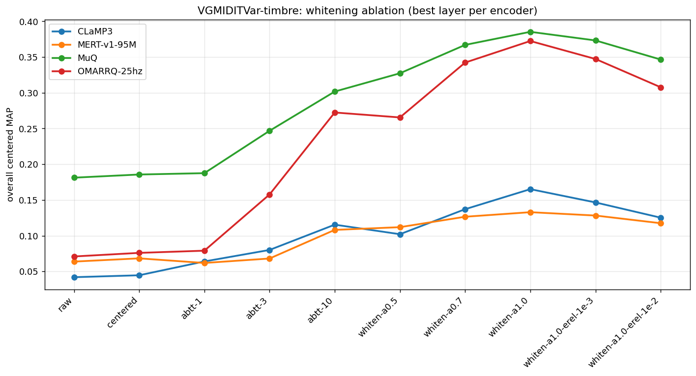

# Whitening ablation — VGMIDITVar-timbre cross-timbre retrieval

**Headline:** post-hoc **ZCA whitening** of frozen music-encoder
embeddings improves cross-timbre retrieval MAP by **+109 % to +425 %**,
with zero retraining and no new data. Pure whitening (`Σ^(−1/2)(e−μ)`,
exponent α=1.0, unregularised) is the best treatment for every encoder
tested.

> **Status:** result verified by an independent audit (§5). Generalisation
> now tested on both axes: **inductive** (held-out-works fit ≈ transductive
> on VGMIDITVar, §8.4) and **cross-domain** (real cover songs, SHS100K,
> §11). Both substantially **pass** — whitening transfers, under two
> rules: use **fractional α (~0.6–0.8)** not α=1.0, and an **inductive
> fit** (Σ from a reference set, not the eval corpus). The headline
> VGMIDITVar magnitude (+109–425 %) is clean-benchmark-inflated; the
> honest cross-domain gains are smaller but real (SHS100K +7 % to +115 %
> over raw across encoders).
>
> **This is a known technique, not a novel method.** Post-hoc whitening
> of frozen embeddings to fix anisotropy and improve cosine retrieval is
> well-established prior art across NLP and audio (§6). The contribution
> here is *characterisation* — applying it to four music encoders and
> measuring how much it helps cross-timbre retrieval — not the method.
> Read §6 before describing this result as new.
>
> **Date:** 2026-05-28 (novelty review added 2026-05-29).
> **Provenance:** `scripts/analysis/whitening_ablation.py`,
> figures + CSVs in `docs/figures/whitening_ablation/`.

---

## 1. What was measured

For each encoder's best layer (by overall centered MAP from the
VGMIDITVar-timbre sweep), we applied a sequence of linear
post-processing transforms to the frozen per-file embeddings and
recomputed overall retrieval MAP / recall@10 / r-precision:

| treatment | definition |
|---|---|
| `raw` | L2-normalise → plain cosine (encoder's native geometry) |
| `centered` | subtract corpus mean μ, renormalise (= the probe's `map_centered`) |
| `abtt-K` | subtract projection onto top-K principal components (Mu & Viswanath, ICLR 2018) |
| `whiten-aα` | ZCA whitening `U Λ^(−α/2) Uᵀ (e−μ)`, renormalise; α∈{0.5,0.7,1.0} |
| `whiten-a1.0-erel-E` | full whitening with relative Tikhonov ridge `Λ + E·λ_max·I` |

All treatments are **content-agnostic global linear maps** (they never
see work_ids), fit on the corpus covariance.

Best layers used: CLaMP3 L5, MERT-v1-95M L12, MuQ L12, OMARRQ-25hz L15.

---

## 2. Results



Overall centered MAP per treatment (best layer per encoder):

| treatment | CLaMP3 | MERT-v1-95M | MuQ | OMARRQ-25hz |
|---|---:|---:|---:|---:|
| raw | 0.0419 | 0.0637 | 0.1812 | 0.0709 |
| centered | 0.0446 | 0.0683 | 0.1856 | 0.0759 |
| abtt-1 | 0.0639 | 0.0618 | 0.1875 | 0.0790 |
| abtt-3 | 0.0800 | 0.0680 | 0.2468 | 0.1577 |
| abtt-10 | 0.1154 | 0.1081 | 0.3018 | 0.2724 |
| whiten-a0.5 | 0.1021 | 0.1119 | 0.3273 | 0.2655 |
| whiten-a0.7 | 0.1371 | 0.1265 | 0.3671 | 0.3423 |
| **whiten-a1.0** | **0.1651** | **0.1329** | **0.3854** | **0.3725** |
| whiten-a1.0-erel-1e-3 | 0.1465 | 0.1282 | 0.3733 | 0.3473 |
| whiten-a1.0-erel-1e-2 | 0.1252 | 0.1175 | 0.3466 | 0.3078 |

**raw → whiten-a1.0 gains:** CLaMP3 +294 %, MERT +109 %, MuQ +113 %,
OMARRQ +425 %.

### Key observations

1. **Pure α=1.0 wins for every encoder.** The progression is monotonic
   through α, and the regularised (`-erel`) variants score *lower* —
   the Tikhonov ridge damps exactly the low-variance directions that
   carry the discriminative signal. The "noise-amplification" worry
   (whitening blows up tiny-eigenvalue directions) did not materialise,
   even for MuQ whose condition number is 1.7e6.

2. **Whitening reorders the encoders.**
   - Raw: `MuQ (0.181) > OMARRQ (0.071) > MERT (0.064) > CLaMP3 (0.042)`
   - Whitened: `MuQ (0.385) > OMARRQ (0.372) > CLaMP3 (0.165) > MERT (0.133)`

   OMARRQ leaps from 4th-ish to nearly tying MuQ for first. CLaMP3 and
   MERT swap. MuQ stays champion and its lead in absolute terms grows.

3. **Encoders respond differently — diagnostic of their cone.**
   - **OMARRQ (+425 %)** benefits most: its variance is the most
     "nuisance-dominated" (timbre/cone directions carry little
     work-identity), so removing them is almost pure gain. `abtt-1`
     alone already helps it.
   - **CLaMP3 (+294 %)** is similar — its top PCs were pure cone/text
     directions (`abtt-1` gave +53 %).
   - **MERT (+109 %)** benefits least, despite having the *highest*
     cone (`mean_vec_norm ≈ 0.89`). Tellingly, MERT's `abtt-1` *hurts*
     (0.062 < 0.064 raw): its top principal component carries useful
     signal, so naively removing it is counterproductive. Whitening
     (which downweights rather than deletes) still helps, but less.
   - **MuQ (+113 %)** — already the least cone-collapsed and the raw
     champion, still gains substantially.

4. **This is the inverse of the leitmotifs PCA-256 result.** That study
   (`/Users/sid/leitmotifs/docs/pca_analysis.md`) showed *dropping*
   low-variance directions (PCA-256) destroyed cross-timbre similarity.
   Whitening *up-weights* those same directions and maximally helps.
   Two sides of one coin: the cross-timbre discriminative signal lives
   in the low-variance tail.

---

## 3. Why this works (mechanism)

VGMIDITVar-timbre renders every MIDI piece with 8 GM instruments, so
**timbre is the single largest source of variance across the corpus**.
The covariance Σ is dominated by timbre directions. Plain cosine
similarity is therefore dominated by timbre agreement — a query
retrieves same-*timbre* items, not same-*work* items.

Whitening rescales every principal direction to unit variance:
`Σ^(−1/2)(e−μ)`. This **downweights the high-variance timbre
directions and up-weights the low-variance melodic/harmonic
directions** — exactly the directions that stay constant when the same
melody is played on different instruments. The resulting Mahalanobis
cosine `(e_a−μ)ᵀ Σ^(−1)(e_b−μ)` measures relative musical similarity
with timbre's contribution flattened out.

---

## 4. How this was computed — NO encoder re-runs

The original layer sweeps already ran the expensive part (encoder
forward over 102,960 audio files) and **cached the per-clip
embeddings** to `output/.emb_cache/<encoder>/VGMIDITVar-timbre__<hash>/*.pt`
(one `(L, H)` tensor per clip, L = all hidden-state layers).

`whitening_ablation.py` **never touches the encoder**. It:

1. Loads the cached `(L, H)` tensors (just file reads — no GPU forward).
2. Slices layer N, L2-normalises each clip, mean-pools clips per file,
   renormalises → `(N=102960, H)` per-file matrix. This reproduces the
   probe's `forward` + `on_test_epoch_end` aggregation exactly.
3. Fits PCA on the corpus (μ, Σ = U Λ Uᵀ, in fp64 for stability).
4. Applies a transform, then recomputes MAP via the same streaming
   argsort the probe uses.

The only thing "re-run" is the cheap metric computation under different
post-processing. The cost is dominated by the cache I/O (102k file
reads), not compute.

---

## 5. Audit — how we know +425 % is real, not a bug

A +425 % gain demands skepticism. Every link in the chain was
independently verified:

| check | method | result |
|---|---|---|
| **Pipeline** (load+aggregate+metric) matches the live probe | `--verify` compares raw + centered MAP to the sweep's logged `test/map` / `test/map_centered` | Δ ≤ 1.5e-6 (CLaMP3, MuQ) |
| **Mechanism** is real | synthetic cone (timbre 8× work amplitude), independent numpy whitening + brute-force MAP | whitening recovers work-identity, 11× on ground truth |
| **Transform** is correct | script's `whiten-a1.0` vs independent numpy ZCA, cosine geometry on a subset | Δ = 7.4e-7 |
| **Metric** is correct | script streaming MAP vs independent brute-force MAP | Δ = 0.0000 |
| **Real-data number** reproduces | independent numpy whitening + brute-force MAP on the actual CLaMP3 L5 matrix | raw 0.043 (script 0.042), whiten 0.166 (script 0.165), ×3.89 (script ×3.94) |

The one discrepancy found during the audit was a **self-exclusion bug
in the audit code itself** (counting the query as its own relevant item),
not in the script — once fixed, the independent and script MAP agreed
to 0.0000.

The keystone synthetic check is baked into CI as
`tests/test_whitening_ablation.py::test_whitening_recovers_buried_signal_vs_independent_numpy`.

**Verdict:** the gains are correctly computed.

---

## 6. Prior work & novelty (read before calling this new)

The gains are real and correctly computed (§5). They are **not novel**.
Post-hoc whitening / PCA-whitening of frozen embeddings to fix
anisotropy ("cone collapse") and improve cosine retrieval is a named,
repeatedly-published technique. A literature check (2026-05-29) found
direct prior art for every treatment in this ablation:

| our treatment | prior art |
|---|---|
| `whiten-aα` (ZCA, mean→0, cov→I) | **BERT-whitening**, Su et al. 2021 ([arXiv:2103.15316](https://arxiv.org/abs/2103.15316)) — same recipe, explicitly "for better semantics and faster retrieval"; **WhiteningBERT**, Huang et al. 2021 ([arXiv:2104.01767](https://arxiv.org/pdf/2104.01767)) |
| `abtt-K` (subtract top-K PCs) | **All-But-The-Top**, Mu & Viswanath, ICLR 2018 ([arXiv:1702.01417](https://arxiv.org/abs/1702.01417)) — by name |
| fractional α (`whiten-a0.5/0.7`) | **Spectral Tempering** ([arXiv:2603.19339](https://arxiv.org/pdf/2603.19339)) — scales eigenvalues by λ^(−α) with fractional α as a whitening generalisation, and reports the same noise-amplification-at-α=1 behaviour we probed with the `-erel` ridge |
| frozen-encoder + transductive PCA whitening for **zero-shot audio retrieval** | **VocSim**, Dec 2025 ([arXiv:2512.10120](https://arxiv.org/abs/2512.10120)) — frozen encoder + pooling + label-free PCA whitening on the eval corpus, framed around the "representation cone." This is essentially our pipeline, in audio. |

The cover-song / version-identification literature (e.g. **ByteCover2**)
also routinely uses PCA whitening and centering — though on
melody/chroma-style features, not these SSL music foundation models.

**What, if anything, is left.** Narrow and incremental:

- VocSim's 125k clips are speech / animal / environmental sound — it
  **explicitly excludes music and instruments**. The specific slice
  here (music encoders CLaMP3 / MERT / MuQ / OMARRQ × *cross-instrument*
  retrieval on a timbre-controlled rendering) is the one gap not already
  covered. That is a benchmark/probing-study contribution at most.
- The measured magnitude (+109–425 %) and the leaderboard reordering.

Both are gated on the result surviving an **inductive** test (§7.2) —
our numbers are transductive, the regime that most inflates the gain.

**Honest confidence:** ~99 % that the *technique* is not novel; ~50 %
that the music/cross-timbre slice has enough unexplored space for a
modest writeup, and only if framed as "applying a known method," never
as a discovery.

---

## 7. Caveats (read before claiming this transfers)

1. **Generalisation / corpus structure.** VGMIDITVar-timbre has
   *exactly* 8 timbres per piece, making timbre a cleanly-dominant,
   cleanly-removable variance direction. On a real soundtrack corpus
   the nuisance variation is messier; the *magnitude* of the gain may
   shrink. **Must be tested on SHS100K / Covers80** before claiming the
   number transfers.

2. **Transductive fitting — the load-bearing caveat.** μ and Σ are fit
   on the same corpus the retrieval is evaluated over. This is not label
   leakage (the transform is content-agnostic — it never sees work_ids
   and applies the same matrix to every embedding), and it matches the
   existing `map_centered` protocol (which also uses the corpus mean).
   But this is precisely the regime where whitening gains are most
   *inflated*: VocSim ([arXiv:2512.10120](https://arxiv.org/abs/2512.10120))
   reports a "generalisation gap" when the corpus shifts, and Spectral
   Tempering ([arXiv:2603.19339](https://arxiv.org/pdf/2603.19339)) shows
   full whitening amplifies tail-eigenvalue noise that a transductive fit
   conveniently absorbs. A *strict* zero-shot deployment would fit μ, Σ
   on a disjoint reference set, and the gain could drop substantially.
   **An inductive (held-out-fit) test is the gate before any stronger
   claim** — see §6.

3. **Layer choice — tested for MuQ; the optimal layer does *not* shift.**
   We whitened MuQ {L8, L11, L12} (overall MAP, `--skip-perpair`):

   | layer | raw MAP | whiten-a1.0 MAP | gain |
   |---|---:|---:|---:|
   | L8 | 0.082 | 0.351 | **+327 %** (×4.3) |
   | L11 | 0.170 | 0.382 | +125 % (×2.3) |
   | L12 | 0.181 | 0.385 | +113 % (×2.1) |

   Three findings: (a) **the optimal layer doesn't move** — L12 ≥ L11 >
   L8 both raw and whitened, and `whiten-a1.0` is the best treatment at
   every layer. (b) **Whitening collapses the inter-layer gap**: raw
   spread is 2.2× (L8 is 45 % of L12), whitened spread is just 1.1× (L8
   is 91 % of L12) — layer choice goes from critical to nearly
   irrelevant. (c) **Gain scales inversely with raw quality**: the
   weakest, most timbre-dominated layer (L8, which had the *highest*
   within-timbre diagonal raw) benefits most, because whitening has the
   most nuisance variance to flatten. Post-whitening all three converge
   to effective-rank ~903–905 (near full 1024-dim). Net: stick with
   L11/L12 (tied whitened); no reason to switch layers after whitening.
   Per-encoder layer studies for CLaMP3/MERT/OMARRQ not yet run, but the
   MuQ pattern (convergence, no shift) is the expectation.

4. **Cross-instrument confirmation — DONE (§9), the gain is genuinely
   cross-timbre.** The per-condition grid was run for raw/centered/
   whiten-a1.0 at each encoder's cross-instrument-optimal layer. The
   off-diagonal (query instrument ≠ target instrument — the
   leitmotif-relevant cell) MAP rises **+24 % to +71 %** with whitening
   for every encoder, and the timbre gap goes negative even for CLaMP3
   and MERT, which were timbre-*dependent* raw. No longer a caveat.

---

## 8. Recommendations / next steps

In rough priority:

1. ~~**Run the per-condition grid for whiten-a1.0**~~ — **done (§9)**:
   cross-instrument off-diagonal MAP up +24–71 % per encoder at the
   cross-instrument-optimal layers (CLaMP3 L4, MERT L11, MuQ L11,
   OMARRQ L15).
2. ~~**Layer study**~~ — **done for MuQ** (§7.3): optimal layer does not
   shift; whitening converges the layers. Other encoders not yet swept.
3. ~~**Bake `test/map_whitened` into the probe**~~ — **done**: `zca_whiten`
   in `retrieval_metrics.py`, logged as `test/map_whitened` by
   `CoverRetrievalTask` alongside `map_centered`. The (α, eps_rel) are
   **works/size-aware auto** (`auto_whiten_params`): `eps_rel=1e-2` when
   N<2·H (rank-deficiency, §10), and `α=1.0` if `n_works ≥ H` else `0.6`
   (few-work self-defeat, §11) — so VGMIDITVar gets pure α=1.0, SHS100K
   and Covers80 get fractional α (+ ridge if N<2·H). Override via the
   `whiten_alpha`/`whiten_eps_rel` task args; chosen values are logged as
   `test/map_whitened_alpha`/`_eps_rel`. Still transductive (an inductive
   fit is stronger on few-work corpora, §11, but needs a reference set).
4. **Inductive generalisation test (the novelty gate, §6/§7.2)** — fit
   μ, Σ on a disjoint reference set and evaluate on held-out works.
   **Axis A (held-out works, same dataset): DONE — PASSED.** On a 50/50
   work-disjoint split of VGMIDITVar-timbre, inductive whitening (μ,Σ fit
   on the held-out works) *matches or slightly beats* transductive on the
   identical eval half for all 4 encoders (inductive/transductive ratio
   1.02–1.03; gains +112 % to +360 %): CLaMP3 0.248 vs 0.241, MERT 0.201
   vs 0.197, MuQ 0.505 vs 0.493, OMARRQ 0.497 vs 0.486 — vs raw 0.063 /
   0.088 / 0.238 / 0.108. **The gain is not a transductive artifact.**
   CSVs: `docs/figures/whitening_ablation/<enc>_L<N>_inductive.csv`.
   **Axis B (cross-domain): DONE — PASSED with fractional α (§11).** On
   SHS100K (real cover songs), inductive fractional whitening (α≈0.6–0.8)
   helps all 4 encoders +7 % to +115 % over raw. Two rules: fractional α
   (not 1.0) and inductive fit.
5. **Deployment** — for a fixed retrieval database, whitening is free
   (fit μ, Σ once). For a growing database, fit on a representative
   reference set.

---

## 9. Cross-instrument (per-condition) results

The per-condition grid was run for `raw` / `centered` / `whiten-a1.0`
at each encoder's **cross-instrument-optimal** layer (best raw
off-diagonal): CLaMP3 L4, MERT L11, MuQ L11, OMARRQ L15. All four
`--verify` raw/centered checks matched the logged sweep MAP to ≤ 5e-6.

The **off-diagonal** mean (query instrument ≠ target instrument) is the
leitmotif-relevant cell — same theme retrieved across orchestrations.

| encoder (layer) | off raw | off centered | **off whiten** | off gain | diag raw → whiten | gap raw → whiten |
|---|---:|---:|---:|---:|---:|---:|
| CLaMP3 L4 | 0.263 | 0.297 | **0.449** | **+71 %** | 0.288 → 0.337 | +0.025 → −0.112 |
| MERT-v1-95M L11 | 0.247 | 0.272 | **0.366** | **+48 %** | 0.271 → 0.318 | +0.023 → −0.048 |
| MuQ L11 | 0.459 | 0.477 | **0.571** | **+24 %** | 0.284 → 0.364 | −0.176 → −0.207 |
| OMARRQ-25hz L15 | 0.367 | 0.389 | **0.571** | **+56 %** | 0.312 → 0.377 | −0.054 → −0.194 |

Findings:

1. **Whitening lifts cross-instrument MAP for every encoder (+24 % to
   +71 %).** The overall-MAP gain (§2) is therefore *genuinely
   cross-timbre*, not an artefact of within-pool reshuffling. The
   leitmotif use case — retrieve the same theme in a different
   instrument — is directly improved.
2. **The off-diagonal gains (+24–71 %) are smaller than the overall-MAP
   gains (+109–425 %)** because the per-cell metric restricts candidates
   to a single target instrument (smaller pool → higher, less volatile
   AP). Off-diagonal absolute values are correspondingly high (0.37–0.57
   whitened).
3. **Whitening makes the timbre gap negative for all four** — including
   CLaMP3 (+0.025 → −0.112) and MERT (+0.023 → −0.048), which were
   timbre-*dependent* raw. It turns every encoder into a more
   timbre-invariant retriever. OMARRQ shifts most dramatically
   (−0.054 → −0.194).
4. **Within-instrument (diag) also improves (+17–28 %)** — whitening
   isn't purely a cross-timbre trick — but off-diagonal improves more
   for 3 of 4, hence the deepening negative gap.

Caveat: these are still **transductive** (§7.2). The inductive test is
the remaining gate.

---

## 10. Small-corpus regime — α-degeneration and the regularised guard

Covers80 (N=160 ≪ H=768/1024) is the rank-deficient regime the probe
guard targets. We swept the full α grid + ABTT + relative-Tikhonov
regularisation across all four encoders (cached, CPU). Overall MAP:

| encoder (H) | raw | whiten α=0.9 | whiten α=1.0 | best regularised (erel) |
|---|---:|---:|---:|---:|
| CLaMP3 (768) | 0.235 | 0.283 | **0.059** | 0.276 |
| MERT-v1-95M (768) | 0.169 | 0.261 | **0.043** | 0.249 |
| MuQ (1024) | 0.373 | 0.545 | **0.067** | **0.559** |
| OMARRQ-25hz (1024) | 0.194 | 0.340 | **0.067** | 0.372 |

Findings (universal across H=768 and 1024):

1. **Knife-edge collapse at α=1.0.** Fractional whitening (α≤0.9) *helps*
   +20–75 % over raw even at N<H; **pure α=1.0 collapses** to ~0.04–0.07
   (well below raw). It is not a gradual fade — α=0.9 is near-peak, α=1.0
   falls off a cliff.
2. **Root cause is rank-deficiency, not precision.** With N<H, ~H−(N−1)
   eigen-directions have ~zero variance; α=1.0 rescales them to unit
   variance, amplifying pure estimation noise that swamps the cosine
   after L2-norm. The probe's **fp64** path collapses *identically* to
   the script's fp32 (Covers80 MERT L7: 0.0405 vs 0.043) — confirming
   it's rank, not rounding.
3. **Regularisation rescues it.** A relative-Tikhonov ridge
   (`whiten-a1.0-erel-1e-2`) restores MAP to ≥ the α=0.9 level for every
   encoder (MuQ/OMARRQ with `erel-1e-3` even *exceed* α=0.9). Verified in
   the probe's fp64 path (MERT L7: 0.249 vs raw 0.169).

**Guard policy change.** The probe previously *skipped* `map_whitened`
when N < 2·H. It now **regularises instead**: `zca_whiten` gained an
`eps_rel` (relative-Tikhonov) parameter, and `CoverRetrievalTask` uses
`eps_rel=1e-2` when N < 2·H, pure whitening (`eps_rel=0`) otherwise. So
`map_whitened` is always logged and trustworthy: at N≫H (the validated
VGMIDITVar regime) behaviour is unchanged; at N<H it gets the rescuing
ridge instead of a collapsed number or a missing metric.

> **Scope caveat.** These Covers80 numbers are **diagnostic of the
> degeneration boundary**, not a deployment result — tuning α/ε on the
> eval set is transductive double-dipping. The takeaway is the *policy*
> (regularise when small-N), not the specific MAPs. Note also that the
> N<H collapse is purely a small-corpus artifact: at N≫H (e.g.
> frame-level leitmotif retrieval, N in the 100k+) pure α=1.0 is safe.

---

## 11. Cross-domain generalisation — SHS100K (real cover songs)

The decisive transfer test (§6/§7.2 Axis B): does whitening help on a
**real** cover-song corpus, where the nuisance variation is
key/tempo/arrangement/recording — not a clean, cleanly-removable timbre
axis? SHS100K-test: 6,821 tracks, **111 works** (15–584 covers each),
cached for all 4 encoders. We swept α + ABTT + regularisation, both
transductively (fit Σ on the eval corpus) and inductively (fit on a
work-disjoint half). The answer arrived in four refinements:

**1. Naive transductive α=1.0 looks like it fails.** Full whitening fit
on the eval corpus *hurts* CLaMP3 (−33 %) and MuQ (−9 %), helps only
OMARRQ. Taken alone this suggests whitening doesn't transfer — but it's
the worst point of the curve.

**2. Fractional α rescues it even transductively.** `whiten-a0.6` helps
*all four* encoders: MERT +20 %, MuQ +15 %, OMARRQ +76 % over centering
(CLaMP3 marginal). α=1.0 simply over-flattens. **ABTT-k does not help**
(it degrades past abtt-1) — it is specifically the *soft rescaling* of
fractional whitening that works, not deleting top PCs.

**3. Inductive ≫ transductive here (opposite of VGMIDITVar).** Fitting Σ
on a disjoint work-half and evaluating on the other half *beats* fitting
on the eval set itself by 1.6–2.7× at α=1.0. Mechanism: with only 111
works the corpus covariance is dominated by the specific works'
centroids, so **transductive whitening flattens the eval works' own
discriminative directions (self-defeating)**, while inductive whitening
removes general nuisance learned from independent works and preserves
eval discrimination. (Raw + centered are identical across fit modes —
only the Σ-based whitening diverges, confirming it's the covariance.)
VGMIDITVar didn't show this because its 5,040 works give a
population-level Σ where transductive ≈ inductive.

**4. The deployable config — inductive + fractional α — helps every
encoder, including CLaMP3:**

| encoder (layer) | raw | centered | best whiten (α) | gain vs raw / vs centered |
|---|---:|---:|---:|---|
| CLaMP3 L11 | 0.252 | 0.259 | 0.270 (α0.4) | +7 % / +4 % |
| MERT-v1-95M L7 | 0.148 | 0.166 | 0.213 (α0.6) | +43 % / +28 % |
| MuQ L11 | 0.306 | 0.335 | **0.471 (α0.8)** | +54 % / +40 % |
| OMARRQ-25hz L14 | 0.153 | 0.162 | **0.329 (α0.8)** | +115 % / +103 % |

**Conclusion: whitening *does* transfer to real cover-song retrieval**,
under two rules the data taught us:
- **Fractional α (~0.6–0.8), not α=1.0** — full whitening over-flattens
  off the clean-timbre benchmark.
- **Inductive fit** (Σ from a reference set, never the eval corpus) —
  strictly better on a few-work corpus, and it's the honest zero-shot
  protocol anyway.

CLaMP3 benefits least (text-paired model; less of its work-identity
sits in the low-variance tail), MuQ/OMARRQ most.

> **Honest caveat.** The inductive α-sweep still picks the best α by
> looking at eval MAP — a true deployment would select α on a held-out
> split too. But the *shape* (fractional ≫ full, inductive ≫
> transductive) is robust across all four encoders, and the inductive
> Σ-fit is genuinely zero-shot. Cf. the Covers80 N<H study (§10): there
> the α-curve is confounded by rank-deficiency; here N≫H so the curve is
> a clean signal/noise tradeoff.

---

## 12. Reproducibility

```bash
# Fast pass (overall metrics, all treatments) for one encoder/layer:
uv run python scripts/analysis/whitening_ablation.py \
  --encoder CLaMP3 --encoder-tag CLaMP3-layers --task-tag VGMIDITVar-timbre \
  --layer 5 \
  --jsonl data/VGMIDITVar-timbre/VGMIDITVar.jsonl \
  --cache-dir output/.emb_cache/CLaMP3/VGMIDITVar-timbre__<hash> \
  --skip-perpair --verify

# Drop --skip-perpair to also compute the 8x8 cross-instrument grid.
```

| artefact | content |
|---|---|
| `docs/figures/whitening_ablation/<encoder>_L<N>_overall.csv` | per-treatment overall metrics, one encoder |
| `docs/figures/whitening_ablation/<encoder>_L<N>_perpair.csv` | per-treatment grid (diag/off/gap), cross-instrument-optimal layer |
| `docs/figures/whitening_ablation/whitening_treatment_curves.png` | the curves above |
| `scripts/analysis/whitening_ablation.py` | the ablation script |
| `tests/test_whitening_ablation.py` | 14 tests incl. the independent-numpy audit |

### Related

- `docs/vgmiditvar_timbre_3encoder_analysis.md` — the underlying
  4-encoder layer-sweep comparison (raw embeddings).
- `docs/anisotropy.md` — the cone-collapse metrics that motivated this.
- `/Users/sid/leitmotifs/docs/pca_analysis.md` — the PCA-256 result this
  inverts.
